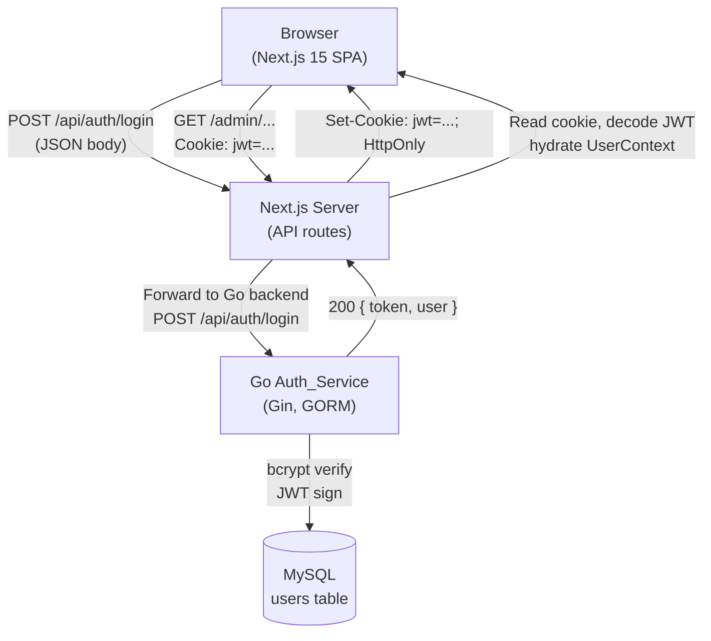
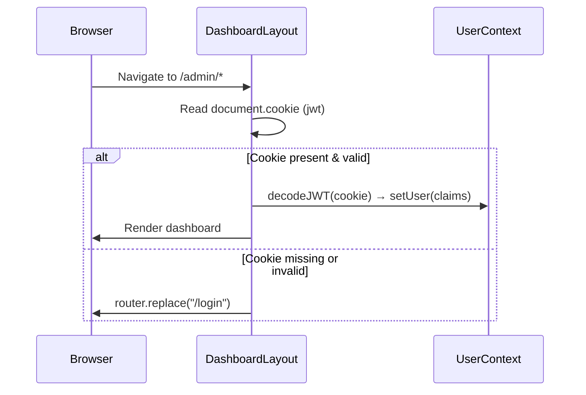

# Design Document — Authentication System

## Overview

This document describes the full-stack authentication system for the Monitoring Operational RDK application. The system spans two codebases:

- **Go backend** (`Auth_Service`): Gin + GORM + MySQL. Exposes `POST /api/auth/login`, issues JWTs, and enforces `AuthMiddleware` + `RoleMiddleware` on protected routes.
- **Next.js frontend** (`Monitoring-RDK`): Handles the login UI, stores the JWT as an HttpOnly cookie via a Next.js API route, hydrates a global `UserContext` on every page load, guards all `/admin/*` routes in `DashboardLayout`, and wires user identity into the `UserDropdown` component.

The two codebases communicate only through HTTP. The frontend never embeds business logic for password validation or JWT signing — those belong exclusively to the backend.

### Key Design Decisions

| Decision | Rationale |
|---|---|
| JWT stored as HttpOnly cookie (not `localStorage`) | Prevents XSS access to the token; `localStorage` is readable by any JavaScript on the page. |
| Next.js API route proxies cookie-set | Browser security policies prevent client-side JS from setting `HttpOnly` cookies directly; a `/api/auth/set-cookie` server route is the only safe way to do it from Next.js. |
| JWT decoded on the client (not re-validated) | The frontend only needs to read claims (name, role, email) for display. Re-validation of signature happens on every backend request via `AuthMiddleware`. |
| `jose` library for client-side JWT decoding | Zero dependency on a Node crypto backend; works in the Next.js edge/browser runtime. `jwt-decode` is an alternative but `jose` is more standards-aligned and actively maintained. |
| Repository pattern in Go | Decouples the service layer from GORM; makes unit-testing the service layer possible without a real database. |
| Seeder runs at `cmd` startup (guarded by email check) | Ensures the default admin always exists after a fresh deploy without risking duplicate rows. |

---

## Architecture

### System Context



### Backend Layered Architecture

```
Auth_Service/
├── cmd/
│   └── main.go              ← entry point; runs seeder, starts HTTP server
├── config/
│   └── config.go            ← reads env vars; panics if required vars are missing
├── database/
│   └── database.go          ← opens GORM connection; runs AutoMigrate
├── seeders/
│   └── user_seeder.go       ← inserts default SUPER_ADMIN if not exists
├── models/
│   └── user.go              ← User struct (GORM model)
├── dto/
│   └── auth_dto.go          ← LoginRequest / LoginResponse structs with binding tags
├── repositories/
│   └── user_repository.go   ← FindByEmail(email), FindByID(id) — DB abstraction
├── services/
│   └── auth_service.go      ← business logic: verify password, issue JWT
├── controllers/
│   └── auth_controller.go   ← HTTP handler: binds DTO, calls service, writes response
├── middlewares/
│   ├── auth_middleware.go   ← validates Authorization: Bearer <jwt>
│   └── role_middleware.go   ← checks claims.Role == SUPER_ADMIN
├── utils/
│   └── jwt.go               ← GenerateToken(user), ParseToken(token) helpers
└── routes/
    └── routes.go            ← registers public + protected route groups
```

### Frontend Architecture

```
src/
├── app/
│   ├── login/
│   │   └── page.jsx         ← Login UI (existing shell, to be wired up)
│   ├── api/
│   │   └── auth/
│   │       ├── set-cookie/
│   │       │   └── route.ts ← POST: receives { token }, sets HttpOnly cookie
│   │       └── logout/
│   │           └── route.ts ← POST: clears the cookie
│   └── admin/
│       ├── layout.jsx        ← delegates to DashboardLayout
│       └── ...pages
├── contexts/
│   └── UserContext.tsx       ← createContext, UserProvider, useUser hook
└── components/
    └── layout/
        ├── DashboardLayout.tsx ← auth guard: redirect to /login if no valid JWT
        └── UserDropdown.tsx    ← wired to useUser(); logout calls /api/auth/logout
```

### Request Flow — Login

```mermaid
sequenceDiagram
    participant U as Browser
    participant LP as LoginPage
    participant AR as /api/auth/set-cookie
    participant BE as Go Auth_Service

    U->>LP: Submit form (email, password)
    LP->>LP: Client-side validation (non-empty)
    LP->>BE: POST /api/auth/login { email, password }
    BE->>BE: FindByEmail → bcrypt.Compare → GenerateToken
    BE-->>LP: 200 { token, user } | 401 | 400
    LP->>AR: POST /api/auth/set-cookie { token }
    AR-->>U: Set-Cookie: jwt=...; HttpOnly; SameSite=Strict; Path=/
    LP->>LP: setUser(user) → UserContext
    LP->>U: router.push("/admin")
```

### Request Flow — Page Refresh (Hydration)



---

## Components and Interfaces

### Backend: Go Interfaces

#### `UserRepository` interface
```go
type UserRepository interface {
    FindByEmail(email string) (*models.User, error)
    FindByID(id string) (*models.User, error)
}
```

#### `AuthService` interface
```go
type AuthService interface {
    Login(req dto.LoginRequest) (*dto.LoginResponse, error)
}
```

#### `dto.LoginRequest`
```go
type LoginRequest struct {
    Email    string `json:"email"    binding:"required,email"`
    Password string `json:"password" binding:"required"`
}
```

#### `dto.LoginResponse`
```go
type LoginResponse struct {
    Token string   `json:"token"`
    User  UserInfo `json:"user"`
}

type UserInfo struct {
    ID    string `json:"id"`
    Name  string `json:"name"`
    Email string `json:"email"`
    Role  string `json:"role"`
}
```

#### JWT Claims
```go
type Claims struct {
    ID    string `json:"id"`
    Email string `json:"email"`
    Role  string `json:"role"`
    jwt.RegisteredClaims
}
```

#### Route Groups
```
Public:
  POST /api/auth/login        → AuthController.Login

Protected (AuthMiddleware + RoleMiddleware):
  /api/admin/*                → (future admin endpoints)
```

### Frontend: TypeScript Interfaces

#### `UserContext`
```typescript
interface User {
  id: string;
  name: string;
  email: string;
  role: string;
}

interface UserContextValue {
  user: User | null;
  setUser: (user: User | null) => void;
  logout: () => Promise<void>;
}
```

#### `UserProvider` behaviour
- On mount: reads `jwt` cookie from `document.cookie`; if present, decodes the payload and calls `setUser` with the claims.
- Exposes `logout()`: calls `POST /api/auth/logout` (clears cookie server-side), then calls `setUser(null)` and `router.replace('/login')`.

#### Next.js API Routes

| Route | Method | Purpose |
|---|---|---|
| `/api/auth/set-cookie` | POST | Accepts `{ token: string }`, sets `jwt` as `HttpOnly; SameSite=Strict; Secure; Path=/` cookie with `Max-Age` derived from JWT `exp`. |
| `/api/auth/logout` | POST | Clears the `jwt` cookie by setting `Max-Age=0`. |

---

## Data Models

### Go — `models.User`

```go
type User struct {
    ID        string    `gorm:"type:varchar(36);primaryKey"`
    Name      string    `gorm:"type:varchar(255);not null"`
    Email     string    `gorm:"type:varchar(255);uniqueIndex;not null"`
    Password  string    `gorm:"type:varchar(255);not null"`   // bcrypt hash
    Role      string    `gorm:"type:varchar(50);not null"`    // e.g. SUPER_ADMIN
    Status    string    `gorm:"type:varchar(50);not null"`    // e.g. ACTIVE
    CreatedAt time.Time
    UpdatedAt time.Time
}
```

### MySQL DDL (equivalent)

```sql
CREATE TABLE users (
    id         VARCHAR(36)  NOT NULL PRIMARY KEY,
    name       VARCHAR(255) NOT NULL,
    email      VARCHAR(255) NOT NULL,
    password   VARCHAR(255) NOT NULL,
    role       VARCHAR(50)  NOT NULL,
    status     VARCHAR(50)  NOT NULL,
    created_at TIMESTAMP    NOT NULL DEFAULT CURRENT_TIMESTAMP,
    updated_at TIMESTAMP    NOT NULL DEFAULT CURRENT_TIMESTAMP ON UPDATE CURRENT_TIMESTAMP,
    UNIQUE KEY uq_users_email (email)
);
```

### Default Seeded Row

| Field | Value |
|---|---|
| name | Putri Mas |
| email | putrimas@monitoring.rdk.com |
| password | bcrypt(`putrimas123`) |
| role | SUPER_ADMIN |
| status | ACTIVE |

### Frontend — Cookie and Context

The JWT cookie payload carries:

```json
{
  "id":    "<uuid>",
  "email": "putrimas@monitoring.rdk.com",
  "role":  "SUPER_ADMIN",
  "exp":   1234567890
}
```

The `UserContext` state shape mirrors the backend `UserInfo` DTO:

```typescript
{ id, name, email, role }
```

Note: `name` is not in the JWT payload — it is returned in the login response body and stored in `UserContext` at login time. On page refresh, `name` is populated from the decoded cookie claims only if `name` is included as a JWT claim (which the backend should add). If `name` is excluded from the JWT, a `/api/me` endpoint would be needed for refresh hydration. The recommended approach is to include `name` in the JWT claims to avoid an extra round trip.

---

## Correctness Properties

*A property is a characteristic or behavior that should hold true across all valid executions of a system — essentially, a formal statement about what the system should do. Properties serve as the bridge between human-readable specifications and machine-verifiable correctness guarantees.*

### Property 1: Valid credentials always yield a structurally correct login response

*For any* user record in the database with `status = ACTIVE`, submitting a POST to `/api/auth/login` with that user's correct email and password SHALL return HTTP 200 with a response body containing non-empty `data.token`, `data.user.id`, `data.user.name`, `data.user.email`, and `data.user.role` fields.

**Validates: Requirements 1.1**

---

### Property 2: Wrong or non-existent credentials always yield 401

*For any* combination of (email, password) where either the email does not exist in the database OR the password does not match the stored bcrypt hash, the Login_API SHALL return HTTP 401 — never HTTP 200 and never a token.

**Validates: Requirements 1.2, 1.3**

---

### Property 3: Inactive users are rejected like wrong credentials

*For any* user record whose `status` is not `ACTIVE`, the Login_API SHALL return HTTP 401 regardless of whether the submitted password is correct.

**Validates: Requirements 1.5**

---

### Property 4: JWT claims round-trip through parse

*For any* user, the JWT generated by `GenerateToken(user)` SHALL, when parsed by `ParseToken(token)`, yield claims whose `id`, `email`, and `role` fields are identical to the values from the original user record.

**Validates: Requirements 2.1, 2.2**

---

### Property 5: AuthMiddleware rejects any non-valid token

*For any* string that is not a current, correctly signed JWT for an active user — including expired tokens, malformed strings, missing headers, or tokens for inactive users — `AuthMiddleware` SHALL return HTTP 401 and SHALL NOT call the next handler.

**Validates: Requirements 2.4, 2.5, 2.6, 2.7**

---

### Property 6: RoleMiddleware is role-exclusive

*For any* authenticated request, `RoleMiddleware` SHALL allow the request to proceed if and only if the token's `role` claim equals `SUPER_ADMIN`; all other role values SHALL receive HTTP 403.

**Validates: Requirements 3.1, 3.2**

---

### Property 7: Client-side form rejects blank fields

*For any* submission of the login form where either the email field or the password field is empty (including whitespace-only strings), the frontend SHALL NOT dispatch a network request to the backend.

**Validates: Requirements 6.2, 6.3**

---

### Property 8: UserContext hydrates correctly from JWT cookie

*For any* valid JWT cookie present in the browser, the `UserProvider` on mount SHALL populate `user.id`, `user.email`, and `user.role` with the exact values decoded from the JWT payload.

**Validates: Requirements 8.3**

---

### Property 9: Logout clears all auth state

*For any* authenticated session, calling `logout()` SHALL result in: the `jwt` cookie being cleared, `UserContext.user` being `null`, and the user being redirected to `/login`.

**Validates: Requirements 8.4, 9.1**

---

### Property 10: UserDropdown displays real user data

*For any* authenticated user stored in `UserContext`, the `UserDropdown` component SHALL render the user's `name`, the formatted `role` string, the user's `email`, and the initials derived from `name` — and SHALL NOT render hardcoded placeholder values.

**Validates: Requirements 10.1, 10.2, 10.3**

---

## Error Handling

### Backend

| Scenario | HTTP Status | Response Body |
|---|---|---|
| Malformed / missing request body | 400 | `{ "success": false, "message": "Request tidak valid" }` |
| Wrong email or password | 401 | `{ "success": false, "message": "Email atau Password salah" }` |
| Account not active | 401 | `{ "success": false, "message": "Email atau Password salah" }` |
| Missing / expired / malformed JWT | 401 | `{ "success": false, "message": "Token tidak valid atau sudah kadaluarsa" }` |
| Valid JWT but user not active | 401 | `{ "success": false, "message": "Akun tidak aktif atau tidak ditemukan" }` |
| Wrong role | 403 | `{ "success": false, "message": "Akses ditolak" }` |
| Missing required env var at startup | Process exit (non-zero) | Log error to stderr before terminating |

**Note on error homogenisation**: wrong email and wrong password both return the same message (`"Email atau Password salah"`) to prevent user enumeration attacks.

### Frontend

| Scenario | Behaviour |
|---|---|
| Empty email or password | Inline validation error; no network request |
| Network / fetch error | Toast: generic "Terjadi kesalahan, coba lagi" |
| 401 from backend | Toast: `"Email atau Password salah"` |
| 400 from backend | Toast: `"Request tidak valid"` |
| Cookie-set API route failure | Error message displayed; no redirect |
| No valid JWT cookie on dashboard load | Immediate `router.replace('/login')` |
| Authenticated user visits `/login` | `router.replace('/admin')` |

---

## Testing Strategy

### Backend (Go)

**Unit tests** (table-driven, `testing` package + `testify`):
- `auth_service_test.go`: mock `UserRepository`; test correct login, wrong password, inactive user, DB error.
- `jwt_test.go`: `GenerateToken` then `ParseToken` round-trip (Property 4).
- `auth_middleware_test.go`: valid token passes, expired fails, malformed fails, inactive user fails (Property 5).
- `role_middleware_test.go`: SUPER_ADMIN passes, other roles get 403 (Property 6).

**Integration tests** (spin up test MySQL with `docker-compose`):
- `POST /api/auth/login` with correct/incorrect credentials against a real database with seeded data (Properties 1, 2, 3).

**Property-based testing** (Go):
- Use [**rapid**](https://github.com/pgregory/rapid) (Go PBT library).
- Each property test runs a minimum of **100 iterations**.
- Tag format: `// Feature: authentication-system, Property N: <property text>`

| Property | Test file | Generator |
|---|---|---|
| P1: Valid credentials return correct response | `auth_service_pbt_test.go` | Generate active users with random name/email/password |
| P2: Wrong credentials yield 401 | `auth_service_pbt_test.go` | Generate user + random wrong password string |
| P3: Inactive users are rejected | `auth_service_pbt_test.go` | Generate users with random non-ACTIVE status values |
| P4: JWT claims round-trip | `jwt_pbt_test.go` | Generate random User structs; verify claim fidelity |
| P5: AuthMiddleware rejects non-valid tokens | `auth_middleware_pbt_test.go` | Generate random strings, expired tokens, tokens for inactive users |
| P6: RoleMiddleware is role-exclusive | `role_middleware_pbt_test.go` | Generate random role strings; SUPER_ADMIN passes, all others get 403 |

### Frontend (Next.js / TypeScript)

**Unit tests** (`vitest` + `@testing-library/react`):
- `LoginPage.test.tsx`: blank email blocked, blank password blocked, loading state shown, 401 toast shown.
- `UserContext.test.tsx`: `setUser` populates context, `logout` clears it.
- `UserDropdown.test.tsx`: renders real name/role/email/initials from context (not hardcoded values).
- `DashboardLayout.test.tsx`: no cookie → `router.replace('/login')` called.

**Property-based tests** (`vitest` + [`fast-check`](https://github.com/dubzzz/fast-check)):
- Each property test runs a minimum of **100 iterations**.
- Tag format: `// Feature: authentication-system, Property N: <property text>`

| Property | Test file | Generator |
|---|---|---|
| P7: Form rejects blank fields | `LoginPage.pbt.test.tsx` | Arbitrary empty/whitespace strings for email and password |
| P8: UserContext hydrates from JWT cookie | `UserContext.pbt.test.tsx` | Generate random `{ id, email, role }` → build fake JWT → verify context |
| P9: Logout clears all auth state | `UserContext.pbt.test.tsx` | Arbitrary user states; verify cookie cleared + user null + redirect |
| P10: UserDropdown displays real user data | `UserDropdown.pbt.test.tsx` | Generate arbitrary User records; verify rendered output contains correct fields and derived initials |

**End-to-end (optional, Playwright)**:
- Full login → dashboard → logout flow with the real backend running.
