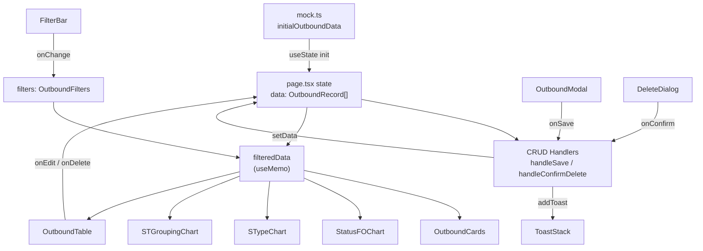

# Design Document — Outbound Module Refactor + Manual CRUD

## Overview

This document covers the full replacement of the `/admin/outbound` page in Monitoring-RDK (Wings Group). The existing implementation — which used `plant`, `vendor`, `noPolisi`, `driver`, `statusFO`, `totalBox`, `totalQty`, `jamLoading`, `jamBerangkat` as data fields and rendered `VendorPerformanceChart` and `DeliveryTrendChart` — is completely removed and replaced with a new data model based on the Excel Outbound sheet structure.

The refactored module delivers:
- A new `OutboundRecord` type with 13 domain fields aligned to the Excel sheet
- 4 KPI Cards (Total Mobil Muat, Muat Inap, Muat Pagi, Rit 2)
- 3 charts: Status FO horizontal bar chart, S-Type donut chart, STW grouping bar chart
- A full Filter Bar (date range, STATUS, S-TYPE, free-text search)
- A paginated detail table with 14 columns
- Full CRUD via a modal form and delete confirmation dialog
- Auto-dismissing toast notifications

### Key Design Decisions

| Decision | Rationale |
|---|---|
| Full file replacement, not incremental patch | Old field names are semantically incompatible with the new model. A clean replace avoids type-mixing bugs and dead code. |
| Colocated components under `src/app/admin/outbound/` | Follows the established pattern of `gantungan-faktur` and `inbound` modules in this project. All files are discoverable in one place. |
| Mock data as single state source (no backend) | No API exists yet. `initialOutboundData` in `mock.ts` seeds the in-memory React state. Swapping to a real API later requires only changing the `useState` initializer. |
| `applyFilters` as pure function in `page.tsx` | Keeps filter logic testable in isolation. `filteredData` is derived via `useMemo` — every consumer re-renders automatically when state or filters change. |
| `freightOrder` as business-level unique identifier | `id` (UUID-style) is the technical key; `freightOrder` is the human-visible identifier that must be unique in the dataset. Uniqueness is validated in the modal before save. |
| STW duration computed at chart render time | `jamTerima` and `selesaiMuat` are stored as `"HH:MM"` strings. Duration is computed on-demand in `STGroupingChart.tsx` via `useMemo`, not stored on the record, to keep the data model simple. |
| `React.memo` on every component | Prevents unnecessary re-renders when the parent page re-renders due to unrelated state changes (e.g., a toast being added). |

---

## Architecture

### Module Structure

```
src/app/admin/outbound/
├── page.tsx              ← "use client"; page state, CRUD handlers, layout
├── types.ts              ← Single source of truth for all TypeScript types
├── mock.ts               ← initialOutboundData (≥ 25 records)
├── OutboundCards.tsx     ← 4 KPI cards
├── StatusFOChart.tsx     ← Horizontal bar chart — STATUS distribution
├── STypeChart.tsx        ← Donut chart — S-TYPE distribution
├── STGroupingChart.tsx   ← Bar chart — STW grouping buckets
├── FilterBar.tsx         ← Filter controls (date range, STATUS, S-TYPE, search)
├── OutboundTable.tsx     ← Paginated table with Edit/Delete per row
└── OutboundModal.tsx     ← Create/Edit form modal
```

`DeleteDialog` and `ToastStack` are inlined inside `page.tsx` (no separate files) because they have no external consumers and depend tightly on page-level state.

### Data Flow



Every component receives `filteredData` (not the full `data` array), so filters are applied once at the top level and propagated consistently to all visualizations and the table.

---

## Components and Interfaces

### `types.ts`

```typescript
// STATUS union — the only valid STATUS values
export type STATUS = "Open" | "Close" | "Cancel" | "Partial";

// Primary domain entity — matches Excel Outbound sheet
export interface OutboundRecord {
  id: string;                  // Internal UUID, e.g. "OB-2026-001"
  tanggal: string;             // "YYYY-MM-DD"
  freightOrder: string;        // Business-level unique identifier
  mobilMuat: string;           // Vehicle plate / identifier
  sType: string;               // Delivery type, e.g. "Regular", "Express"
  assignJob: string;           // Job assignment label
  jamTerima: string;           // "HH:MM" — time FO received
  status: STATUS;              // Freight order status
  selesaiMuat: string;         // "HH:MM" — time loading completed
  hari: string;                // Day label, e.g. "Senin"
  putaran: string;             // Delivery round identifier
  st: number;                  // Standard time value (≥ 0)
  h2: number;                  // H+2 delivery value (≥ 0)
  jamRunning: string;          // "HH:MM" — running time
}

// Raw form strings (before parsing to typed values)
export interface OutboundFormValues {
  tanggal: string;
  freightOrder: string;
  mobilMuat: string;
  sType: string;
  assignJob: string;
  jamTerima: string;
  status: string;
  selesaiMuat: string;
  hari: string;
  putaran: string;
  st: string;
  h2: string;
  jamRunning: string;
}

export type OutboundFormErrors = Partial<Record<keyof OutboundFormValues, string>>;

export type CrudMode = "create" | "edit";

export interface ModalState {
  open: boolean;
  mode: CrudMode;
  record?: OutboundRecord;
}

export interface OutboundFilters {
  dateRange: {
    startDate: string | null;
    endDate: string | null;
  };
  selectedStatus: string[];
  selectedSType: string[];
  searchQuery: string;
}

export type ToastVariant = "success" | "error";

export interface ToastMessage {
  id: string;
  variant: ToastVariant;
  message: string;
}
```

### `OutboundCards.tsx`

Props: `{ data: OutboundRecord[] }`

KPI categories are determined by business rules applied to field values:

| Card | Rule |
|---|---|
| Total Mobil Muat | `data.length` |
| Muat Inap | Records where the loading category classifies as overnight (Muat Inap) |
| Muat Pagi | Records where the loading category classifies as morning (Muat Pagi) |
| Rit 2 | Records where `putaran` indicates a second-round delivery (Rit 2) |

The exact classification rules for Muat Inap, Muat Pagi, and Rit 2 are derived from domain field values (`hari`, `putaran`, `jamTerima`, or a combination). The design treats these as configurable predicate functions so they can be adjusted without touching KPI card rendering logic. The implementation should expose these predicates as pure functions in the same file for testability.

```typescript
// Classification predicates (pure functions, exported for testing)
export function isMuatInap(record: OutboundRecord): boolean { /* ... */ }
export function isMuatPagi(record: OutboundRecord): boolean { /* ... */ }
export function isRit2(record: OutboundRecord): boolean { /* ... */ }

export function calculateKPIs(data: OutboundRecord[]) {
  const total = data.length;
  const muatInap = data.filter(isMuatInap).length;
  const muatPagi = data.filter(isMuatPagi).length;
  const rit2 = data.filter(isRit2).length;
  return { total, muatInap, muatPagi, rit2 };
}
```

### `StatusFOChart.tsx`

Props: `{ data: OutboundRecord[] }`

Pure transform function (exported for testing):

```typescript
export function buildStatusFOData(records: OutboundRecord[]): StatusFODataPoint[]
// Returns array sorted descending by count, filtered to count > 0
```

Recharts layout: `BarChart layout="vertical"` inside `ResponsiveContainer`.
Color map: `"Open"` → `#10B981`, `"Close"` → `#3B82F6`, `"Cancel"` → `#EF4444`, `"Partial"` → `#F59E0B`.

### `STypeChart.tsx`

Props: `{ data: OutboundRecord[] }`

Pure transform function (exported for testing):

```typescript
export function buildSTypeData(records: OutboundRecord[]): STypeDataPoint[]
// Returns array with { name: string, value: number, color: string }
```

Recharts component: `PieChart` with `innerRadius` set to create a donut shape, wrapped in `ResponsiveContainer`. Color palette cycles through at least 5 distinct colors from the design system.

### `STGroupingChart.tsx`

Props: `{ data: OutboundRecord[] }`

STW duration computation and bucketing (exported for testing):

```typescript
// Returns null if either time string is missing/invalid
export function parseTimeToMinutes(time: string): number | null

export function computeSTWMinutes(
  jamTerima: string,
  selesaiMuat: string
): number | null

export function bucketSTW(minutes: number): STWBucket
// Buckets: "< 30 Menit" | "30–60 Menit" | "60–90 Menit" | "> 90 Menit"

export function buildSTWData(records: OutboundRecord[]): STWDataPoint[]
```

The chart excludes records where `computeSTWMinutes` returns `null`. The four buckets are mutually exclusive and cover the full range [0, ∞).

### `FilterBar.tsx`

Props:
```typescript
interface FilterBarProps {
  filters: OutboundFilters;
  availableSTypes: string[];       // Derived from full data, not filteredData
  onChange: (partial: Partial<OutboundFilters>) => void;
  onReset: () => void;
}
```

Note: STATUS options are fixed (`"Open"`, `"Close"`, `"Cancel"`, `"Partial"`). S-TYPE options are dynamic from `availableSTypes` prop (computed from the full unfiltered `data` in `page.tsx`).

Filter application logic (pure function in `page.tsx`, exported for testing):

```typescript
export function applyFilters(
  data: OutboundRecord[],
  filters: OutboundFilters
): OutboundRecord[]
```

Search targets `freightOrder` and `mobilMuat` (case-insensitive). The search input is debounced 300ms internally in `FilterBar.tsx` before calling `onChange`.

### `OutboundTable.tsx`

Props:
```typescript
interface OutboundTableProps {
  data: OutboundRecord[];
  onEdit: (record: OutboundRecord) => void;
  onDelete: (record: OutboundRecord) => void;
}
```

14 columns: Tanggal | FREIGHT ORDER | Mobil Muat | S-TYPE | Assign Job | JAM TERIMA | STATUS | Selesai Muat | HARI | PUTARAN | ST | H2 | JAM RUNNING | Action

STATUS badge colors match the StatusFOChart color map. Pagination state (current page, page size) is local to the component. Default page size: 10. The table wrapper has `overflow-x-auto` and the inner `<table>` has a `min-w-[900px]` to support horizontal scroll on mobile.

### `OutboundModal.tsx`

Props:
```typescript
interface OutboundModalProps {
  open: boolean;
  mode: CrudMode;
  record?: OutboundRecord;
  saving: boolean;
  existingFreightOrders: string[];  // For uniqueness validation
  currentId?: string;               // Record being edited (to skip self-check)
  onSave: (values: OutboundFormValues) => Promise<void>;
  onClose: () => void;
}
```

Validation function (pure, exported for testing):

```typescript
export function validateOutboundForm(
  values: OutboundFormValues,
  existingFreightOrders: string[],
  currentId?: string
): OutboundFormErrors
```

Rules enforced by `validateOutboundForm`:
1. All 13 fields are required (no empty or whitespace-only values).
2. `st` parsed as number must be ≥ 0.
3. `h2` parsed as number must be ≥ 0.
4. `status` must be one of `"Open"`, `"Close"`, `"Cancel"`, `"Partial"`.
5. `freightOrder` must not exist in `existingFreightOrders` (unless `currentId` matches the record that owns it).

The modal form layout: two-column grid on `sm` and wider, single column on mobile. 13 fields arranged as: Tanggal, FREIGHT ORDER, Mobil Muat, S-TYPE, Assign Job, JAM TERIMA, STATUS, Selesai Muat, HARI, PUTARAN, ST, H2, JAM RUNNING.

### `page.tsx` — Derived state and handlers

```typescript
// Filter application
const filteredData = useMemo(
  () => applyFilters(data, filters),
  [data, filters]
);

// Options for FilterBar S-TYPE dropdown (from full data, not filtered)
const availableSTypes = useMemo(
  () => [...new Set(data.map(r => r.sType))].sort(),
  [data]
);

// FREIGHT ORDER list for uniqueness validation
const existingFreightOrders = useMemo(
  () => data.map(r => r.freightOrder),
  [data]
);
```

All event handlers are memoized with `useCallback`: `handleSave`, `handleEdit`, `handleDeleteClick`, `handleConfirmDelete`, `updateFilters`, `resetFilters`, `addToast`, `dismissToast`, `handleOpenCreate`, `handleCloseModal`, `handleCloseDelete`.

---

## Data Models

### `OutboundRecord` — Field Descriptions

| Field | Type | Constraint | Description |
|---|---|---|---|
| `id` | `string` | Unique | Internal key, e.g. `"OB-2026-001"` |
| `tanggal` | `string` | `"YYYY-MM-DD"` | Delivery date |
| `freightOrder` | `string` | Non-empty, unique | FO number (business key) |
| `mobilMuat` | `string` | Non-empty | Vehicle plate/ID |
| `sType` | `string` | Non-empty | Delivery type |
| `assignJob` | `string` | Non-empty | Job assignment |
| `jamTerima` | `string` | `"HH:MM"` | Time FO was received |
| `status` | `STATUS` | One of 4 values | FO status |
| `selesaiMuat` | `string` | `"HH:MM"` | Loading completion time |
| `hari` | `string` | Non-empty | Day label |
| `putaran` | `string` | Non-empty | Delivery round |
| `st` | `number` | ≥ 0, integer | Standard time |
| `h2` | `number` | ≥ 0, integer | H+2 value |
| `jamRunning` | `string` | `"HH:MM"` | Running time |

### `mock.ts` — `initialOutboundData`

The mock array must satisfy:
- ≥ 25 records, all 13 non-`id` fields populated
- `freightOrder` values are unique across all records
- `status` distribution: majority `"Close"` (~55–65%), remainder spread across `"Open"`, `"Cancel"`, `"Partial"`
- ≥ 3 distinct `sType` values (e.g., `"Regular"`, `"Express"`, `"Cold"`)
- `tanggal` values span ≥ 14 days, not concentrated on one day
- `jamTerima`, `selesaiMuat`, `jamRunning` in valid `"HH:MM"` format
- `st` and `h2` are non-negative integers

### STW Bucket Boundaries

| Bucket Label | Condition |
|---|---|
| `"< 30 Menit"` | `0 ≤ minutes < 30` |
| `"30–60 Menit"` | `30 ≤ minutes < 60` |
| `"60–90 Menit"` | `60 ≤ minutes < 90` |
| `"> 90 Menit"` | `minutes ≥ 90` |

Records where `jamTerima` or `selesaiMuat` is an empty string or does not match `HH:MM` format are excluded from all buckets.

---

## Correctness Properties

*A property is a characteristic or behavior that should hold true across all valid executions of a system — essentially, a formal statement about what the system should do. Properties serve as the bridge between human-readable specifications and machine-verifiable correctness guarantees.*

### Property 1: KPI Invariant

*For any* array of `OutboundRecord` (including empty), calling `calculateKPIs(data)` SHALL produce values where `muatInap + muatPagi + rit2 ≤ total`, and for any `data` with `length > 0`, the percentage of each category equals `(count / total) * 100` within a ±0.5% rounding tolerance.

**Validates: Requirements 3.1, 3.2, 3.3, 3.4, 3.5, 3.6**

---

### Property 2: StatusFO Distribution Sum

*For any* array of `OutboundRecord`, the sum of all `count` values in the result of `buildStatusFOData(data)` SHALL equal `data.length` — every record is counted in exactly one status bucket, and none are omitted or double-counted.

**Validates: Requirements 4.2, 4.3**

---

### Property 3: SType Distribution Sum

*For any* array of `OutboundRecord` with `length > 0`, the sum of all `value` fields in the result of `buildSTypeData(data)` SHALL equal `data.length` — every record contributes to exactly one pie slice.

**Validates: Requirements 5.2**

---

### Property 4: STW Bucket Invariant

*For any* array of `OutboundRecord`, the sum of all bucket counts in `buildSTWData(data)` SHALL equal the count of records for which `computeSTWMinutes(r.jamTerima, r.selesaiMuat)` returns a non-null value. Furthermore, for any record with a valid STW duration, it SHALL appear in exactly one bucket (mutual exclusion across the four bucket boundaries).

**Validates: Requirements 6.2, 6.3, 6.4**

---

### Property 5: Filter Subset

*For any* array of `OutboundRecord` and any `OutboundFilters` object, `applyFilters(data, filters).length` SHALL be ≤ `data.length`. Filters can only reduce or maintain the dataset — they never add records.

**Validates: Requirements 7.1, 7.4, 7.5**

---

### Property 6: Filter Reset Idempotent

*For any* array of `OutboundRecord`, applying the default (reset) filter state via `applyFilters(data, DEFAULT_FILTERS)` SHALL return a result with the same length and contents as the original `data` array.

**Validates: Requirements 7.8, 7.9**

---

### Property 7: Form Validation — Empty Fields and Non-Negative Numbers

*For any* `OutboundFormValues` where one or more fields contain an empty string or a whitespace-only string, `validateOutboundForm(values, [], undefined)` SHALL return an `OutboundFormErrors` object with an entry for every such field. Additionally, for any input where `st` parses to a negative number or `h2` parses to a negative number, the validation SHALL return an error on the respective field.

**Validates: Requirements 9.4, 9.5, 9.6**

---

### Property 8: FREIGHT ORDER Uniqueness

*For any* non-empty array of existing freight orders `existingFreightOrders` and any input value `freightOrder` that is present in that array, calling `validateOutboundForm({ ...values, freightOrder }, existingFreightOrders, undefined)` SHALL always return an error on the `freightOrder` field — there are no false negatives.

**Validates: Requirements 10.1, 10.2, 10.3**

---

### Property 9: Create State Invariant

*For any* initial `data` array and any new valid `OutboundRecord` added via the create handler, the resulting state SHALL have `data.length + 1` records, and the new record SHALL be present in the array.

**Validates: Requirements 13.1, 13.4, 13.5**

---

### Property 10: Edit State Invariant

*For any* initial `data` array and any updated `OutboundRecord` replacing an existing record by `id`, the resulting state SHALL have the same `data.length`, and the record with the matching `id` SHALL reflect the updated field values.

**Validates: Requirements 13.2, 13.4, 13.5**

---

### Property 11: Delete State Invariant

*For any* initial `data` array and any `id` of an existing record that is deleted, the resulting state SHALL have `data.length - 1` records, and no record with the deleted `id` SHALL be present in the array.

**Validates: Requirements 13.3, 13.4, 13.5**

---

## Error Handling

### Form Validation Errors

All validation errors are displayed inline beneath the corresponding field. The form submit button is disabled while errors are present or while `saving` is true.

| Condition | Error message |
|---|---|
| Any required field is empty/whitespace | `"Field ini wajib diisi."` |
| `st` value is negative | `"ST harus bernilai 0 atau lebih."` |
| `h2` value is negative | `"H2 harus bernilai 0 atau lebih."` |
| `status` not in valid enum | `"Pilih status yang valid."` |
| `freightOrder` duplicate (create) | `"FREIGHT ORDER sudah terdaftar."` |
| `freightOrder` duplicate (edit, other record) | `"FREIGHT ORDER sudah terdaftar."` |

### CRUD Operation Errors

Since there is no backend (mock-only), CRUD errors are limited to the validation layer. If a future API is introduced, error handling should follow this pattern:

| Scenario | Toast |
|---|---|
| Create success | `variant="success"`, `"Data outbound berhasil ditambahkan."` |
| Edit success | `variant="success"`, `"Data outbound berhasil diperbarui."` |
| Delete success | `variant="success"`, `"Data outbound berhasil dihapus."` |
| Any unexpected error | `variant="error"`, `"Terjadi kesalahan, coba lagi."` |

### Empty States

| Component | Empty state message |
|---|---|
| `StatusFOChart` | `"Belum ada data outbound."` |
| `STypeChart` | `"Belum ada data outbound."` |
| `STGroupingChart` | `"Belum ada data dengan waktu valid."` |
| `OutboundTable` | Ikon `Inbox` + `"Tidak ada data outbound ditemukan"` |

---

## Testing Strategy

### Approach

This module uses a dual testing approach:
- **Unit / example-based tests**: verify specific scenarios, UI interactions, empty states, and component rendering.
- **Property-based tests**: verify universal invariants across generated inputs — these are the 11 correctness properties above.

Property-based tests use [**fast-check**](https://github.com/dubzzz/fast-check) (already installed as a dev dependency). Unit tests use **vitest** + **@testing-library/react** (both already installed).

### Property-Based Tests

Each property test runs a minimum of **100 iterations**. Tag format comment above each property test:
```
// Feature: outbound-refactor, Property N: <property text>
```

| Property | Test file | Generator description |
|---|---|---|
| P1: KPI Invariant | `OutboundCards.pbt.test.ts` | Arbitrary `OutboundRecord[]` including empty; verify invariant and percentage formula |
| P2: StatusFO Distribution Sum | `StatusFOChart.pbt.test.ts` | Arbitrary `OutboundRecord[]` with random `status` values from the 4-value enum; verify sum = length |
| P3: SType Distribution Sum | `STypeChart.pbt.test.ts` | Arbitrary `OutboundRecord[]` with random `sType` strings; verify sum = length |
| P4: STW Bucket Invariant | `STGroupingChart.pbt.test.ts` | Arbitrary `OutboundRecord[]` with random `jamTerima`/`selesaiMuat` including invalid values; verify sum of buckets = valid count, mutual exclusion |
| P5: Filter Subset | `FilterBar.pbt.test.ts` | Arbitrary `OutboundRecord[]` + arbitrary filter combinations; verify filtered length ≤ original length |
| P6: Filter Reset Idempotent | `FilterBar.pbt.test.ts` | Arbitrary `OutboundRecord[]`; verify reset filter yields same result as no filter |
| P7: Form Validation | `OutboundModal.pbt.test.ts` | Generate `OutboundFormValues` with random empty field subsets and negative st/h2 values; verify errors cover all invalid fields |
| P8: FO Uniqueness | `OutboundModal.pbt.test.ts` | Generate non-empty `string[]` for existingFreightOrders; pick a random element as input; verify error always returned |
| P9: Create Invariant | `page.pbt.test.ts` | Arbitrary initial `OutboundRecord[]` + arbitrary new record; verify length +1 and record present |
| P10: Edit Invariant | `page.pbt.test.ts` | Arbitrary initial `OutboundRecord[]` + arbitrary updated record matching a random existing id; verify length unchanged and record updated |
| P11: Delete Invariant | `page.pbt.test.ts` | Arbitrary initial `OutboundRecord[]` (length ≥ 1); pick random record to delete; verify length -1 and record absent |

### Unit / Example-Based Tests

Unit tests are focused on scenarios not covered by PBT — specific UI behavior, rendering correctness, and edge cases.

| Test file | Covers |
|---|---|
| `OutboundCards.test.tsx` | Empty data shows 0 values, correct icons rendered |
| `StatusFOChart.test.tsx` | Correct color per status, empty state rendered |
| `STypeChart.test.tsx` | Legend rendered, empty state rendered |
| `STGroupingChart.test.tsx` | Records with invalid time strings excluded, bucket labels correct |
| `FilterBar.test.tsx` | Debounce on search, active chips rendered, reset button visibility, removing individual chip |
| `OutboundTable.test.tsx` | 14 columns rendered, status badge colors, pagination controls, empty state with Inbox icon, horizontal scroll wrapper |
| `OutboundModal.test.tsx` | Title changes per mode, pre-populate on edit, loading state on save button, focus trap, Escape closes modal, backdrop click closes modal |
| `page.test.tsx` | Page header renders, toast auto-dismisses after 4000ms, body scroll lock when modal/dialog open, badge count updates after CRUD |

### Build Verification

`npm run build` must complete with exit code 0 and no TypeScript or ESLint errors before this feature is considered complete.
