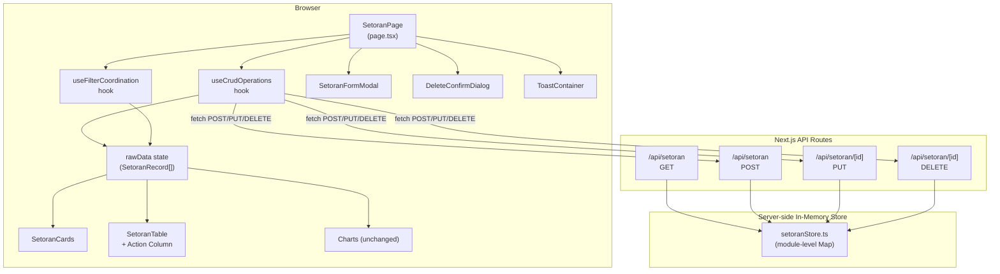
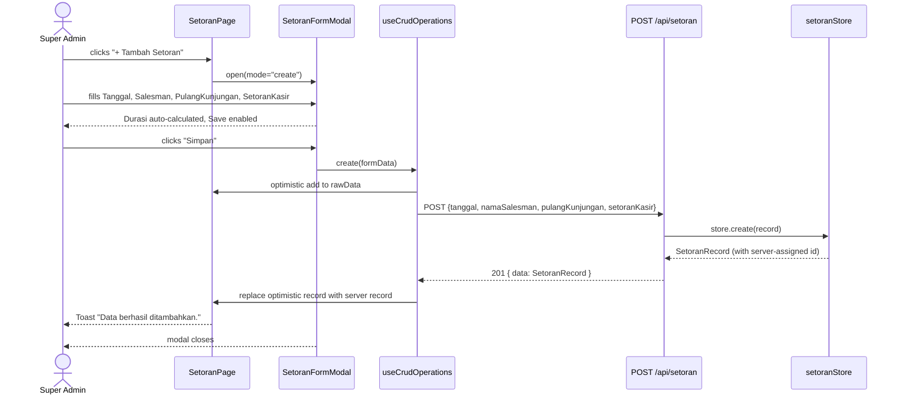
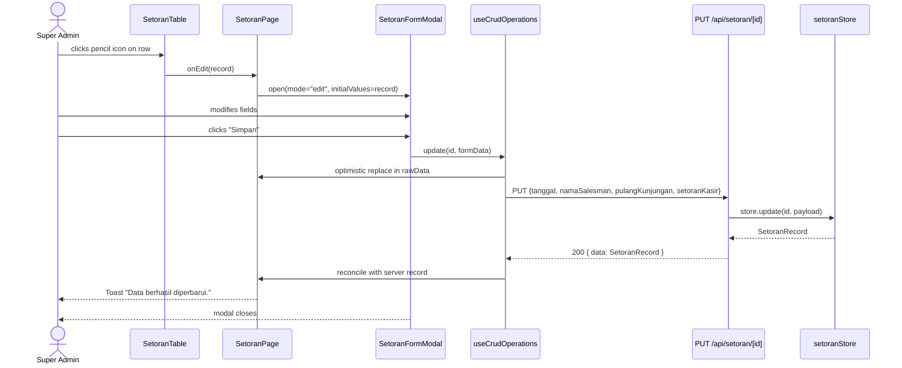
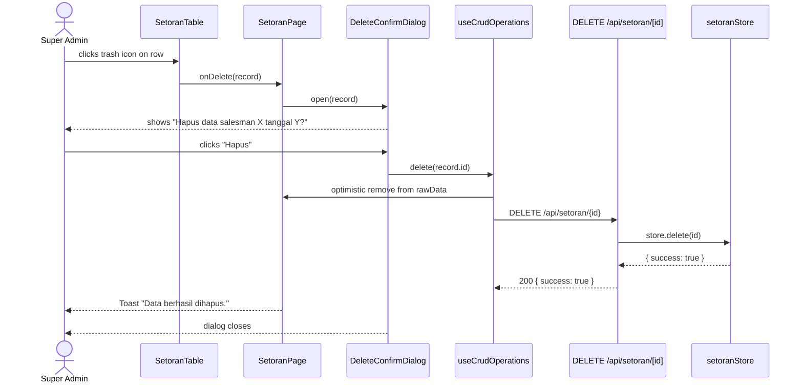
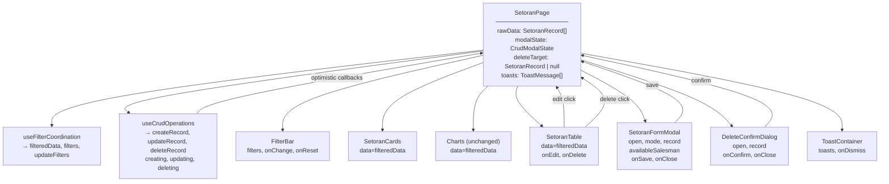

# Design Document: Setoran Dashboard CRUD Enhancement

## Overview

The Setoran Dashboard CRUD Enhancement transforms the existing read-only analytics dashboard at `src/app/admin/setoran/` into a fully interactive data management interface. Super Admin users gain the ability to create, update, and delete `SetoranRecord` entries through modal forms and confirmation dialogs, while all KPI cards, charts, and the data table continue to reflect the current dataset in real time. The enhancement is implemented entirely within the Next.js 15 app-router project using the existing TypeScript, Tailwind CSS, lucide-react, framer-motion, and vitest stack — no new runtime dependencies are added.

The design follows three core principles:
1. **Minimal footprint on existing code** — the dashboard `page.tsx` gains two new state slices and a handful of new imports; all existing components remain structurally unchanged except `SetoranTable` (action column) and `SetoranCards` (fourth KPI card, which already exists in the codebase).
2. **Single source of truth** — an in-memory store (`setoranStore.ts`) is the canonical data layer for both the API routes and the client-side optimistic state so writes are always consistent.
3. **Progressive enhancement** — the UI applies optimistic updates instantly, then reconciles with the API response, providing the sub-500ms feedback required by Requirement 15.


## Architecture




## Sequence Diagrams

### Create Flow



### Update Flow



### Delete Flow




## New / Modified File List

### New Files

| File | Role |
|------|------|
| `src/lib/setoranStore.ts` | Server-side in-memory store (module-level `Map<string, SetoranRecord>`) seeded from `SetoranDataGenerator`. Single canonical data source for all API routes. |
| `src/app/api/setoran/route.ts` | Next.js Route Handler — `GET /api/setoran`, `POST /api/setoran` |
| `src/app/api/setoran/[id]/route.ts` | Next.js Route Handler — `PUT /api/setoran/:id`, `DELETE /api/setoran/:id` |
| `src/app/admin/setoran/hooks/useCrudOperations.ts` | Client hook encapsulating create/update/delete with optimistic updates and toast dispatch |
| `src/app/admin/setoran/components/SetoranFormModal.tsx` | Controlled modal for add/edit. Manages local form state, validation, auto-calc, and salesman autocomplete |
| `src/app/admin/setoran/components/DeleteConfirmDialog.tsx` | Confirmation dialog before a delete |
| `src/app/admin/setoran/components/ToastContainer.tsx` | Fixed-position toast stack. Consumes a `Toast[]` state array managed by `page.tsx` |
| `src/app/admin/setoran/types/crud.ts` | CRUD-specific TypeScript interfaces (`SetoranFormValues`, `CrudApiResponse`, `ToastMessage`, etc.) |

### Modified Files

| File | Change |
|------|--------|
| `src/app/admin/setoran/page.tsx` | Add `rawData` setter, CRUD modal/dialog state, `useCrudOperations`, toast state, "+ Tambah Setoran" button, and pass `onEdit`/`onDelete` callbacks to `SetoranTable` |
| `src/app/admin/setoran/components/SetoranTable.tsx` | Add optional `onEdit` / `onDelete` props; append Action Column header and cells; widen column count from 5 to 6 in empty/skeleton states |
| `src/app/admin/setoran/components/SetoranCards.tsx` | **No change needed** — the fourth "Total Setoran" card is already implemented (Req 6.1 already satisfied in existing code) |


## TypeScript Interface Additions

All new interfaces live in `src/app/admin/setoran/types/crud.ts` and are exported for use across CRUD components.

```typescript
// src/app/admin/setoran/types/crud.ts

import type { SetoranRecord } from "@/types/setoran";

// ─── Form ──────────────────────────────────────────────────────────────────────

/**
 * Raw values from the SetoranFormModal controlled inputs.
 * All strings — parsing/calculation happens in the hook.
 */
export interface SetoranFormValues {
  tanggal: string;            // "YYYY-MM-DD"
  namaSalesman: string;
  pulangKunjungan: string;    // "HH:mm"
  setoranKasir: string;       // "HH:mm"
}

/** Field-level validation errors keyed by SetoranFormValues key */
export type SetoranFormErrors = Partial<Record<keyof SetoranFormValues, string>>;

// ─── Modal state ────────────────────────────────────────────────────────────────

export type CrudModalMode = "create" | "edit";

export interface CrudModalState {
  open: boolean;
  mode: CrudModalMode;
  /** Populated when mode === "edit" */
  record?: SetoranRecord;
}

// ─── API shapes ─────────────────────────────────────────────────────────────────

/** Body sent to POST /api/setoran and PUT /api/setoran/:id */
export interface SetoranWritePayload {
  tanggal: string;
  namaSalesman: string;
  pulangKunjungan: string;
  setoranKasir: string;
}

/** Successful response wrapping a single record */
export interface SetoranDataResponse {
  data: SetoranRecord;
}

/** Successful response for DELETE or other void operations */
export interface SetoranSuccessResponse {
  success: true;
}

/** Error response from any API route */
export interface SetoranErrorResponse {
  error: string;
  field?: keyof SetoranFormValues;
}

export type SetoranApiResponse =
  | SetoranDataResponse
  | SetoranSuccessResponse
  | SetoranErrorResponse;

// ─── Toast ───────────────────────────────────────────────────────────────────────

export type ToastVariant = "success" | "error";

export interface ToastMessage {
  id: string;
  variant: ToastVariant;
  message: string;
}

// ─── Hook return ─────────────────────────────────────────────────────────────────

export interface UseCrudOperationsReturn {
  creating: boolean;
  updating: boolean;
  deleting: boolean;
  createRecord: (values: SetoranFormValues) => Promise<SetoranRecord | null>;
  updateRecord: (id: string, values: SetoranFormValues) => Promise<SetoranRecord | null>;
  deleteRecord: (id: string) => Promise<boolean>;
}
```


## API Route Design

### In-Memory Store: `src/lib/setoranStore.ts`

The store is a plain TypeScript module that holds a `Map<string, SetoranRecord>`. Because Next.js hot-module-replacement resets module state in development, the map is populated lazily from `SetoranDataGenerator` on first access. In production the module persists for the lifetime of the Node.js process (sufficient for an in-memory prototype; a real database would replace this layer).

```typescript
// Sketch — not the full implementation
let _store: Map<string, SetoranRecord> | null = null;

function getStore(): Map<string, SetoranRecord> {
  if (!_store) {
    _store = new Map();
    const records = setoranDataGenerator.generateSetoranData(300, 3);
    for (const r of records) _store.set(r.id, r);
  }
  return _store;
}

export const setoranStore = {
  getAll: (): SetoranRecord[] => [...getStore().values()],
  getById: (id: string): SetoranRecord | undefined => getStore().get(id),
  create: (record: SetoranRecord): SetoranRecord => { getStore().set(record.id, record); return record; },
  update: (id: string, record: SetoranRecord): SetoranRecord | null => {
    if (!getStore().has(id)) return null;
    getStore().set(id, record);
    return record;
  },
  delete: (id: string): boolean => getStore().delete(id),
};
```

### `GET /api/setoran`

Returns all records sorted by `tanggal` descending.

```
Response 200
{
  "data": SetoranRecord[]
}
```

### `POST /api/setoran`

Accepts a `SetoranWritePayload`. Server validates, calculates derived fields, assigns a new `id`, and persists.

```
Request body
{
  "tanggal": "2025-07-10",
  "namaSalesman": "Andi Wijaya",
  "pulangKunjungan": "16:00",
  "setoranKasir": "17:15"
}

Response 201
{
  "data": SetoranRecord   // includes server-calculated durasi, durasiSeconds, bulan, status
}

Response 400  (validation error)
{
  "error": "Jam Setoran harus lebih besar dari Jam Pulang Kunjungan",
  "field": "setoranKasir"
}
```

### `PUT /api/setoran/[id]`

Accepts a `SetoranWritePayload`. Recalculates all derived fields and replaces the stored record.

```
Request body — same shape as POST

Response 200
{
  "data": SetoranRecord
}

Response 404
{
  "error": "Record tidak ditemukan"
}

Response 400  (validation error)
{
  "error": "...",
  "field": "..."
}
```

### `DELETE /api/setoran/[id]`

```
Response 200
{
  "success": true
}

Response 404
{
  "error": "Record tidak ditemukan"
}
```


## Auto-Calculation Logic

All derived fields are computed by a pure utility function shared between the client form and the API route handler, ensuring both sides produce identical values (Requirement 10.5).

```typescript
// src/lib/setoranCalculations.ts

import type { DurasiStatus } from "@/types/setoran";

/** Convert "HH:mm" to total minutes from midnight */
export function timeToMinutes(hhmm: string): number {
  const [h, m] = hhmm.split(":").map(Number);
  return h * 60 + m;
}

/** Convert total seconds to "HH:mm:ss" string */
export function secondsToHHmmss(seconds: number): string {
  const h = Math.floor(seconds / 3600);
  const m = Math.floor((seconds % 3600) / 60);
  const s = seconds % 60;
  return [h, m, s].map((v) => String(v).padStart(2, "0")).join(":");
}

/** Convert total seconds to "HH:mm" string (for Durasi display in form) */
export function secondsToHHmm(seconds: number): string {
  const h = Math.floor(seconds / 3600);
  const m = Math.floor((seconds % 3600) / 60);
  return `${String(h).padStart(2, "0")}:${String(m).padStart(2, "0")}`;
}

/** Determine DurasiStatus from durasiSeconds */
export function computeStatus(durasiSeconds: number): DurasiStatus {
  if (durasiSeconds <= 1800) return "Fast";   // ≤ 30 min
  if (durasiSeconds <= 3600) return "Normal"; // ≤ 60 min
  return "Slow";
}

/** Indonesian month name from a Date */
const MONTH_LABELS: Record<number, string> = {
  0: "Januari", 1: "Februari", 2: "Maret", 3: "April",
  4: "Mei", 5: "Juni", 6: "Juli", 7: "Agustus",
  8: "September", 9: "Oktober", 10: "November", 11: "Desember",
};

export function computeBulan(tanggal: string): string {
  const date = new Date(`${tanggal}T00:00:00`);
  return `${MONTH_LABELS[date.getMonth()]} ${date.getFullYear()}`;
}

/**
 * Compute all derived fields from user-supplied form values.
 * Returns null when setoranKasir <= pulangKunjungan (invalid).
 */
export interface DerivedSetoranFields {
  durasiSeconds: number;
  durasi: string;          // "HH:mm:ss"
  durasiDisplay: string;   // "HH:mm" for form preview
  status: DurasiStatus;
  bulan: string;
  waktuPulang: string;     // ISO datetime
  waktuSetoran: string;    // ISO datetime
}

export function computeDerivedFields(
  tanggal: string,
  pulangKunjungan: string,
  setoranKasir: string
): DerivedSetoranFields | null {
  const pulangMinutes = timeToMinutes(pulangKunjungan);
  const setoranMinutes = timeToMinutes(setoranKasir);

  // Guard: setoran must be AFTER pulang (Requirement 2.2, 10.1)
  if (setoranMinutes <= pulangMinutes) return null;

  const durasiSeconds = (setoranMinutes - pulangMinutes) * 60;

  const baseDate = new Date(`${tanggal}T00:00:00`);
  const waktuPulang = new Date(baseDate.getTime() + pulangMinutes * 60_000).toISOString();
  const waktuSetoran = new Date(baseDate.getTime() + setoranMinutes * 60_000).toISOString();

  return {
    durasiSeconds,
    durasi: secondsToHHmmss(durasiSeconds),
    durasiDisplay: secondsToHHmm(durasiSeconds),
    status: computeStatus(durasiSeconds),
    bulan: computeBulan(tanggal),
    waktuPulang,
    waktuSetoran,
  };
}
```

The `SetoranFormModal` calls `computeDerivedFields` inside a `useEffect` that watches `pulangKunjungan` and `setoranKasir` to drive the live Durasi preview (Requirement 10.4). The API route calls the same function before persisting a record (Requirement 10.5).


## State Management Approach

State is managed at two levels: the dashboard page and individual component local state.

### Dashboard-level state in `SetoranPage` (additions)

```typescript
// rawData — writable array, passed to useFilterCoordination
const [rawData, setRawData] = useState<SetoranRecord[]>(() =>
  setoranDataGenerator.generateSetoranData(300, 3)
);

// Modal state
const [modalState, setModalState] = useState<CrudModalState>({ open: false, mode: "create" });

// Delete dialog
const [deleteTarget, setDeleteTarget] = useState<SetoranRecord | null>(null);

// Toast queue
const [toasts, setToasts] = useState<ToastMessage[]>([]);

// CRUD hook — holds per-operation loading flags
const { creating, updating, deleting, createRecord, updateRecord, deleteRecord } =
  useCrudOperations();
```

### `useCrudOperations` hook

The hook owns the three `isBusy` flags and wraps each operation in a try/catch:

1. Build the optimistic `SetoranRecord` from `formValues + computeDerivedFields`.
2. Update `rawData` immediately (via the `onOptimisticUpdate` callback injected from `page.tsx`).
3. `await fetch(...)` the API route.
4. On success: replace the optimistic record with the server record (for create) or leave it (for update, since fields are the same).
5. On failure: roll back the optimistic change and propagate the error message to the caller for toast display.

This two-callback pattern (`onOptimisticUpdate`, `onRollback`) keeps `rawData` ownership inside `page.tsx` while the hook drives the async lifecycle.

### `SetoranFormModal` local state

```typescript
const [values, setValues] = useState<SetoranFormValues>(initialValues);
const [errors, setErrors] = useState<SetoranFormErrors>({});
const [derived, setDerived] = useState<DerivedSetoranFields | null>(null);
const [submitting, setSubmitting] = useState(false);

// Recalculate whenever pulang/setoran change (Requirement 10.4)
useEffect(() => {
  if (values.pulangKunjungan && values.setoranKasir) {
    setDerived(computeDerivedFields(values.tanggal, values.pulangKunjungan, values.setoranKasir));
  } else {
    setDerived(null);
  }
}, [values.tanggal, values.pulangKunjungan, values.setoranKasir]);
```


## Component Hierarchy and Data Flow



### Props Added to `SetoranTable`

```typescript
interface SetoranTableProps {
  data: SetoranRecord[];
  loading?: boolean;
  searchQuery?: string;
  // --- new ---
  onEdit?: (record: SetoranRecord) => void;
  onDelete?: (record: SetoranRecord) => void;
}
```

When `onEdit` or `onDelete` are undefined, the Action Column is hidden — ensuring the table is backward-compatible with any context that renders it without CRUD access.


## Components and Interfaces

### `SetoranFormModal`

**Purpose**: Modal dialog for adding a new record or editing an existing one.

**Interface**:
```typescript
interface SetoranFormModalProps {
  open: boolean;
  mode: CrudModalMode;                    // "create" | "edit"
  record?: SetoranRecord;                 // populated for edit mode
  availableSalesman: string[];            // from useFilterCoordination
  saving: boolean;                        // from useCrudOperations.creating/.updating
  onSave: (values: SetoranFormValues) => Promise<void>;
  onClose: () => void;
}
```

**Form fields**:
- `Tanggal` — `<input type="date">`, required
- `Nama Salesman` — combobox with `datalist` for autocomplete (no extra library needed); required
- `Pulang Kunjungan` — `<input type="time">`, required
- `Setoran ke Kasir` — `<input type="time">`, required
- `Durasi` — read-only computed display; shows `derived.durasiDisplay` or "—" if invalid

**Validation** (client-side, mirrors server):
- All four fields non-empty
- `setoranKasir > pulangKunjungan`; on failure shows "Jam Setoran harus lebih besar dari Jam Pulang Kunjungan" under the field
- Save button disabled while `submitting || !!Object.keys(errors).length || !derived`

**Responsibilities**:
- Control form field state and validation errors
- Display live Durasi preview
- Call `onSave` with raw `SetoranFormValues`; `onSave` is responsible for derived-field calculation
- Trap focus inside modal when open (accessibility)
- Close on Escape key press or backdrop click

### `DeleteConfirmDialog`

**Purpose**: Confirmation modal before permanent deletion.

**Interface**:
```typescript
interface DeleteConfirmDialogProps {
  open: boolean;
  record: SetoranRecord | null;
  deleting: boolean;
  onConfirm: () => Promise<void>;
  onClose: () => void;
}
```

**Responsibilities**:
- Display salesman name and formatted date of the target record (Requirement 4.3)
- Disable "Hapus" button while `deleting === true`
- Close on cancel or on successful delete (handled by parent via `onClose`)

### `ToastContainer`

**Purpose**: Fixed-position stack of transient notification banners.

**Interface**:
```typescript
interface ToastContainerProps {
  toasts: ToastMessage[];
  onDismiss: (id: string) => void;
}
```

**Responsibilities**:
- Render toasts stacked at bottom-right (desktop) or bottom-center (mobile)
- Auto-dismiss after 4 000 ms using `useEffect` + `setTimeout`
- Animate in/out with framer-motion (`AnimatePresence`)
- Success variant: emerald left border; Error variant: red left border


## Salesman Autocomplete

Requirement 11 requires a searchable salesman dropdown that sources its list from the same `availableSalesman` array already derived by `useFilterCoordination`. No additional library is required — the implementation uses an HTML `<datalist>` element linked to the text input, which provides native browser autocomplete with keyboard navigation and mouse selection support:

```typescript
// Inside SetoranFormModal
<div>
  <input
    type="text"
    list="salesman-list"
    value={values.namaSalesman}
    onChange={(e) => handleChange("namaSalesman", e.target.value)}
    required
    aria-label="Nama Salesman"
    className="..."
  />
  <datalist id="salesman-list">
    {availableSalesman.map((name) => (
      <option key={name} value={name} />
    ))}
  </datalist>
</div>
```

Client-side validation checks `availableSalesman.includes(values.namaSalesman.trim())` on submit. Free-text entry is allowed (a salesman might be new) but the field is required non-empty.

## Error Handling

| Scenario | Client behavior | API behavior |
|----------|----------------|--------------|
| Network failure (fetch throws) | Roll back optimistic update; show error toast with message from catch | N/A |
| 400 validation error from API | Roll back optimistic update; show error toast with `error.error` message | Return `{ error: string, field?: string }` with HTTP 400 |
| 404 on PUT/DELETE (record disappeared) | Roll back; show "Record tidak ditemukan" toast | Return `{ error: "Record tidak ditemukan" }` with HTTP 404 |
| Duplicate create | Prevented client-side by id generation (UUID); server checks for id collision | Return 409 with `{ error: "Record sudah ada" }` |
| Form validation failure (client) | Display inline field errors; Save button disabled | N/A (submission blocked) |


## Testing Strategy

**Test runner**: Vitest + `@testing-library/react` + `jsdom` (already configured in `package.json`).  
**Property-based testing**: `fast-check` (already installed as a dev dependency).

### Unit Tests

#### `src/lib/setoranCalculations.test.ts`

| Test | Type | Description |
|------|------|-------------|
| `computeDerivedFields` returns `null` when setoranKasir ≤ pulangKunjungan | Example | e.g. pulang="17:00", setoran="17:00" |
| `computeDerivedFields` calculates durasiSeconds correctly | Example | pulang="16:00", setoran="17:15" → 4500s |
| `computeDerivedFields` handles cross-midnight times | Example | pulang="23:30", setoran="01:00" — should return null (invalid for business rules) |
| `computeStatus` returns Fast for ≤1800s | Example | 1800s → "Fast" |
| `computeStatus` returns Normal for 1801–3600s | Example | 3600s → "Normal" |
| `computeStatus` returns Slow for >3600s | Example | 3601s → "Slow" |
| `computeBulan` returns correct Indonesian month string | Example | "2025-06-15" → "Juni 2025" |
| `secondsToHHmm` formats correctly | Example | 4500 → "01:15" |

#### `src/lib/setoranStore.test.ts`

| Test | Description |
|------|-------------|
| `getAll` returns all records | Verify initial seed returns array |
| `create` adds a record | `getAll().length` increases by 1 |
| `update` replaces a record | Updated field reflected in `getById` |
| `delete` removes a record | `getById` returns undefined after delete |
| `delete` returns `false` for unknown id | Edge case |

#### `src/app/admin/setoran/components/SetoranFormModal.test.tsx`

| Test | Description |
|------|-------------|
| Renders correctly in "create" mode (all fields empty) | RTL render snapshot |
| Renders correctly in "edit" mode (fields pre-populated) | Check input values |
| Save button is disabled when fields are empty | Assert `disabled` attribute |
| Save button is disabled when setoranKasir ≤ pulangKunjungan | Fill invalid times; assert disabled + error text |
| Save button enables when all fields are valid | Fill valid times; assert enabled |
| Durasi preview updates on time change | Change time inputs; check derived display |
| onSave is called with correct SetoranFormValues on submit | Fire submit; check mock args |
| onClose is called on Escape key press | Keyboard event |
| Salesman datalist contains available salesman names | Check option count |

#### `src/app/admin/setoran/components/DeleteConfirmDialog.test.tsx`

| Test | Description |
|------|-------------|
| Renders salesman name and formatted date | Assert text content |
| Confirm button calls onConfirm | Click; assert mock called |
| Cancel button calls onClose | Click; assert mock called |
| Confirm button is disabled while `deleting === true` | Assert disabled |

#### `src/app/admin/setoran/hooks/useCrudOperations.test.ts`

| Test | Description |
|------|-------------|
| `createRecord` calls POST with correct payload | Spy on fetch; assert request body |
| `createRecord` sets `creating` flag during request | Check flag via `act` |
| `deleteRecord` calls DELETE with correct id | Spy on fetch |
| On API 400 response, `createRecord` returns null | Mock fetch to return 400 |

### Property-Based Tests (fast-check)

```typescript
// setoranCalculations.pbt.test.ts

import fc from "fast-check";
import { computeDerivedFields, timeToMinutes } from "@/lib/setoranCalculations";

test("computeDerivedFields is always null when setoranKasir <= pulangKunjungan", () => {
  fc.assert(
    fc.property(
      fc.integer({ min: 0, max: 1439 }), // pulang: minutes from midnight
      fc.integer({ min: 0, max: 1439 }), // setoran: minutes from midnight
      (pulangMin, setoranMin) => {
        fc.pre(setoranMin <= pulangMin); // guard: invalid time ordering
        const pulang = `${String(Math.floor(pulangMin / 60)).padStart(2, "0")}:${String(pulangMin % 60).padStart(2, "0")}`;
        const setoran = `${String(Math.floor(setoranMin / 60)).padStart(2, "0")}:${String(setoranMin % 60).padStart(2, "0")}`;
        return computeDerivedFields("2025-07-01", pulang, setoran) === null;
      }
    )
  );
});

test("durasiSeconds equals (setoranMinutes - pulangMinutes) * 60 for all valid inputs", () => {
  fc.assert(
    fc.property(
      fc.integer({ min: 0, max: 1438 }),
      fc.integer({ min: 1, max: 1439 }),
      (pulangMin, delta) => {
        const setoranMin = pulangMin + delta;
        fc.pre(setoranMin <= 1439);
        const pulang = `${String(Math.floor(pulangMin / 60)).padStart(2, "0")}:${String(pulangMin % 60).padStart(2, "0")}`;
        const setoran = `${String(Math.floor(setoranMin / 60)).padStart(2, "0")}:${String(setoranMin % 60).padStart(2, "0")}`;
        const result = computeDerivedFields("2025-07-01", pulang, setoran);
        return result !== null && result.durasiSeconds === delta * 60;
      }
    )
  );
});
```

### Integration / Route Tests

Route handlers are tested by calling them directly (Next.js App Router route handlers are plain async functions):

```typescript
// src/app/api/setoran/route.test.ts
import { POST } from "@/app/api/setoran/route";

test("POST /api/setoran returns 400 when setoran <= pulang", async () => {
  const req = new Request("http://localhost/api/setoran", {
    method: "POST",
    body: JSON.stringify({ tanggal: "2025-07-01", namaSalesman: "Andi",
                           pulangKunjungan: "17:00", setoranKasir: "16:00" }),
    headers: { "Content-Type": "application/json" },
  });
  const res = await POST(req);
  expect(res.status).toBe(400);
  const body = await res.json();
  expect(body.error).toMatch(/lebih besar/);
});
```


## Performance Considerations

**Optimistic updates** satisfy Requirement 15.1 (< 500 ms UI feedback) by updating `rawData` synchronously before any network round-trip.

**Memoization** — `useFilterCoordination` already memoizes `filteredData`, `availableMonths`, and `availableSalesman` via `useMemo`. A `setRawData` call triggers a single `filteredData` recalculation; all chart/card child components already use `memo()` and receive stable `filteredData` as their only re-render trigger. No additional memoization is required.

**Table stability** — after a delete the sorted+paginated data slice is recalculated from the new `rawData`, which resets the current page only if the last record on the current page was deleted. The existing `useEffect(() => setPage(1), [data])` in `SetoranTable` handles this gracefully.

**Chart recalculation** — all four charts perform O(n) passes over `filteredData`. With a dataset of ~300 records these complete well under 16 ms. No debouncing is needed for CRUD operations (a single write rather than typed input).

**API caching** — all four route handlers set `Cache-Control: no-store` because data is mutable. The in-memory store means reads are O(n) array copies; no network latency is involved.

## Security Considerations

**Role guard** — Requirement 1.1 implies the `+ Tambah Setoran` button is visible only to Super Admin. The dashboard page already lives under `src/app/admin/` which is protected by the existing auth middleware/layout (`src/app/admin/layout.jsx`). API routes should additionally verify the `role` claim from the JWT cookie (consistent with the authentication system spec) and return 403 if the caller is not a Super Admin.

**Input validation** — all four API route handlers validate and sanitize the `SetoranWritePayload` before touching the store. Time strings are validated against the `HH:mm` regex; date strings against `YYYY-MM-DD`. No SQL injection risk (no database), but output is type-checked via TypeScript.

**No secrets** — the in-memory store contains no PII beyond salesman names (which are mock data). No credentials or tokens are stored in route handler modules.

## Dependencies

No new runtime dependencies are added. The design uses only packages already present in `package.json`:

| Package | Usage |
|---------|-------|
| `next` 15 | App Router Route Handlers (`src/app/api/...`) |
| `react` 19 | Hooks, `memo`, `useEffect`, `AnimatePresence` |
| `typescript` | All new `.ts` / `.tsx` files |
| `tailwindcss` | Styling for modal, dialog, toast, action buttons |
| `lucide-react` | `Pencil`, `Trash2`, `X`, `Check`, `Plus` icons |
| `framer-motion` | Modal/toast enter-exit animations |
| `vitest` + `@testing-library/react` | Unit + component tests |
| `fast-check` | Property-based tests for calculation functions |

## Data Models

### `SetoranRecord` (existing — `src/types/setoran.ts`)

No changes to the canonical type. All CRUD operations produce records that conform to this interface.

```typescript
interface SetoranRecord {
  id: string;                  // "S-001" (existing) or crypto.randomUUID() (new)
  tanggal: string;             // "YYYY-MM-DD"
  bulan: string;               // "Juni 2025" — auto-computed from tanggal
  namaSalesman: string;
  pulangKunjungan: string;     // "HH:mm"
  setoranKasir: string;        // "HH:mm"
  durasiSeconds: number;       // (setoranKasir - pulangKunjungan) in seconds
  durasi: string;              // "HH:mm:ss" — auto-computed
  status: DurasiStatus;        // "Fast" | "Normal" | "Slow" — auto-computed
  waktuPulang: string;         // ISO datetime — auto-computed
  waktuSetoran: string;        // ISO datetime — auto-computed
}
```

**Validation rules for write operations**:
- `tanggal`: matches `/^\d{4}-\d{2}-\d{2}$/`; must be a valid calendar date
- `namaSalesman`: non-empty string; max 100 characters
- `pulangKunjungan`: matches `/^\d{2}:\d{2}$/`; valid 24-hour time
- `setoranKasir`: matches `/^\d{2}:\d{2}$/`; valid 24-hour time; must be strictly after `pulangKunjungan`

### `SetoranWritePayload` (new — `src/app/admin/setoran/types/crud.ts`)

The four user-supplied fields sent in every write API call. All derived fields are computed server-side from these inputs.

```typescript
interface SetoranWritePayload {
  tanggal: string;
  namaSalesman: string;
  pulangKunjungan: string;
  setoranKasir: string;
}
```

### `ToastMessage` (new — `src/app/admin/setoran/types/crud.ts`)

```typescript
interface ToastMessage {
  id: string;           // crypto.randomUUID()
  variant: "success" | "error";
  message: string;      // e.g. "Data berhasil ditambahkan."
}
```

## Correctness Properties

### Property 1: Durasi is always positive for any accepted record

For any valid `SetoranRecord` produced by `computeDerivedFields`, `durasiSeconds > 0`. A record where `setoranKasir ≤ pulangKunjungan` causes `computeDerivedFields` to return `null`, which blocks both client-side submission and server-side persistence.

**Validates: Requirements 2.2, 10.1, 10.3**

### Property 2: Derived fields are internally consistent

For any `SetoranRecord r` produced by `computeDerivedFields(tanggal, pulangKunjungan, setoranKasir)`:
- `r.durasiSeconds === (timeToMinutes(setoranKasir) - timeToMinutes(pulangKunjungan)) * 60`
- `r.durasi === secondsToHHmmss(r.durasiSeconds)`
- `r.bulan === computeBulan(r.tanggal)`
- `r.status === computeStatus(r.durasiSeconds)`

**Validates: Requirements 10.1, 10.2, 10.3, 10.5**

### Property 3: Status thresholds are exhaustive and non-overlapping

For every non-negative integer `durasiSeconds`, `computeStatus` returns exactly one of `Fast | Normal | Slow`:
- `durasiSeconds ≤ 1800 → "Fast"`
- `1801 ≤ durasiSeconds ≤ 3600 → "Normal"`
- `durasiSeconds > 3600 → "Slow"`

**Validates: Requirements 10.1, 12.2**

### Property 4: Optimistic update followed by rollback is identity

Applying a create-then-rollback returns `rawData` to a state with the same records as before the operation. Formally: `length(rawData after create+rollback) === length(rawData before create)`.

**Validates: Requirements 5.1, 5.3, 14.1, 15.1**

### Property 5: Total Setoran KPI equals filteredData.length

For any `filteredData` array, `calculateKPIs(filteredData).totalRecords === filteredData.length`.

**Validates: Requirements 6.1, 6.2, 6.3, 6.4**

### Property 6: Store operations are isolated

A `setoranStore.delete(id)` call does not mutate any record with a different id. A `setoranStore.update(id, payload)` call does not mutate any record with a different id. Both are verified by checking `getAll()` before and after and asserting only the targeted record changed.

**Validates: Requirements 7.3, 7.4, 14.2, 14.5**
