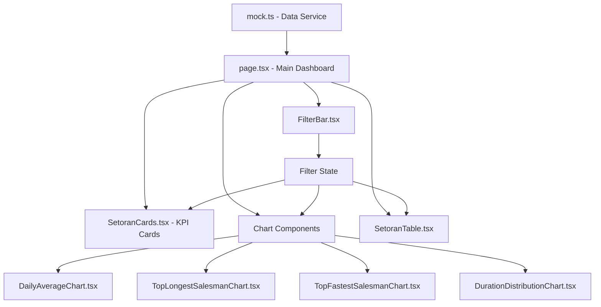
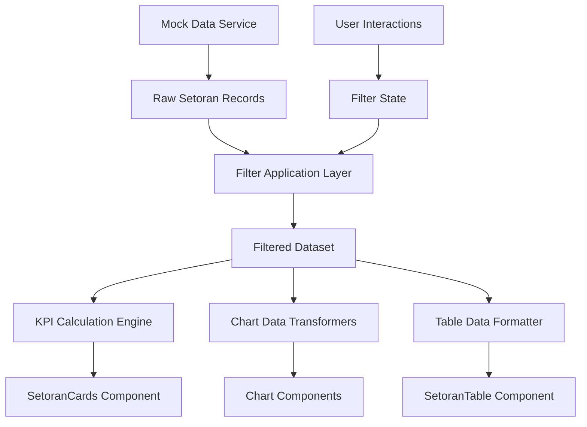
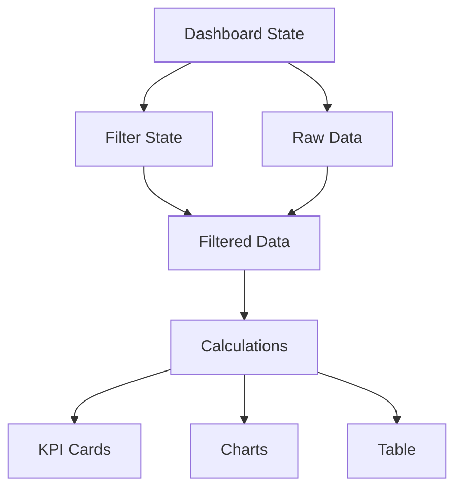

# Setoran Dashboard Technical Design

## Overview

The Setoran Dashboard is a comprehensive React-based analytics interface built with Next.js 15 and TypeScript. It provides real-time insights into salesman setoran (deposit) activities through interactive visualizations, KPI cards, and detailed data tables. The dashboard uses Recharts for data visualization, follows the Wings Group design system, and implements a pure client-side architecture with mock data service for development.

### Key Design Principles

- **Component-based Architecture**: Modular React components with clear separation of concerns
- **Responsive Design**: Mobile-first approach with adaptive layouts for all screen sizes
- **Performance Optimization**: Memoized calculations and efficient re-rendering strategies
- **Type Safety**: Complete TypeScript coverage with strict type checking
- **Design System Compliance**: Consistent visual identity following Wings Group standards

## Architecture

### High-Level Architecture



### File Structure

```
src/app/admin/setoran/
├── page.tsx                          # Main dashboard page component
├── components/
│   ├── SetoranCards.tsx             # Four KPI cards component
│   ├── DailyAverageChart.tsx        # LineChart for daily trends
│   ├── TopLongestSalesmanChart.tsx  # Horizontal bar chart
│   ├── TopFastestSalesmanChart.tsx  # Horizontal bar chart
│   ├── DurationDistributionChart.tsx # Donut chart
│   ├── SetoranTable.tsx             # Detailed data table
│   └── FilterBar.tsx                # Filter controls
├── services/
│   └── mock.ts                      # Mock data generation service
└── types/
    └── setoran.ts                   # TypeScript interfaces
```

### Technology Stack

- **Framework**: Next.js 15 with App Router
- **Language**: TypeScript 5.9.3
- **UI Library**: React 19.1.0
- **Charts**: Recharts 3.1.0
- **Styling**: Tailwind CSS 4.0.0 + Wings Group Design System
- **Icons**: Lucide React 0.546.0
- **State Management**: React Hooks (useState, useMemo, useCallback)
- **Testing**: Vitest + Testing Library + fast-check (for property-based testing)

## Components and Interfaces

### Core Component Architecture

#### 1. Main Dashboard Component (page.tsx)

**Responsibilities:**
- Coordinate overall dashboard state
- Manage filter state propagation
- Orchestrate data flow to child components
- Handle responsive layout switching

**State Management:**
```typescript
interface DashboardState {
  filters: SetoranFilters;
  rawData: SetoranRecord[];
  filteredData: SetoranRecord[];
  loading: boolean;
  error: string | null;
}
```

**Key Features:**
- Centralized filter state management
- Memoized data processing
- Error boundary handling
- Responsive grid system

#### 2. Filter System (FilterBar.tsx)

**Responsibilities:**
- Render all filter controls
- Handle filter state changes
- Validate filter inputs
- Emit filter change events

**Filter Components:**
- Date range picker (start/end dates)
- Month dropdown selector
- Salesman multi-select dropdown
- Text search input with debouncing

#### 3. KPI Cards (SetoranCards.tsx)

**Responsibilities:**
- Calculate and display four key metrics
- Provide responsive card layout
- Handle loading and error states

**KPI Calculations:**
- **Average Duration**: Mean calculation across filtered dataset
- **Longest Salesman**: Salesman with maximum average duration
- **Fastest Salesman**: Salesman with minimum average duration  
- **Total Records**: Count of filtered setoran records

#### 4. Chart Components

##### DailyAverageChart.tsx
- **Chart Type**: Recharts LineChart with smooth curves
- **Data Processing**: Daily duration averages calculation
- **Features**: Responsive container, custom tooltips, date axis formatting

##### TopLongestSalesmanChart.tsx & TopFastestSalesmanChart.tsx
- **Chart Type**: Recharts Bar (horizontal orientation)
- **Data Processing**: Salesman ranking by average duration
- **Features**: Top 10 limiting, responsive bars, performance indicators

##### DurationDistributionChart.tsx
- **Chart Type**: Recharts PieChart (donut configuration)
- **Data Processing**: Duration categorization into ranges
- **Categories**: 0-30min, 30-60min, 60-90min, 90min+
- **Features**: Percentage labels, custom legend, responsive sizing

#### 5. Data Table (SetoranTable.tsx)

**Responsibilities:**
- Display paginated setoran records
- Support column sorting
- Handle responsive table layout
- Provide search highlighting

**Columns:**
- Tanggal (Date)
- Nama Salesman (Salesman Name)
- Pulang Kunjungan (Return Time)
- Setoran ke Kasir (Deposit Time)
- Durasi (Duration - calculated)

### Component Communication Patterns

#### Props-down/Events-up Pattern
```typescript
// Parent passes filtered data and handlers
<SetoranCards 
  data={filteredData} 
  loading={loading}
  onCardClick={handleKpiCardClick}
/>

// Child emits events for parent handling
<FilterBar
  filters={filters}
  onChange={handleFilterChange}
  onReset={handleFilterReset}
/>
```

#### Shared State via Context (Optional Enhancement)
```typescript
interface SetoranContextValue {
  data: SetoranRecord[];
  filters: SetoranFilters;
  updateFilters: (filters: Partial<SetoranFilters>) => void;
  statistics: SetoranStatistics;
}
```

## Data Models

### Core Data Interfaces

```typescript
// Main setoran record structure
interface SetoranRecord {
  id: string;
  tanggal: string; // ISO date string (YYYY-MM-DD)
  salesman: string; // Salesman name
  pulangKunjungan: string; // ISO datetime string
  setoranKasir: string; // ISO datetime string  
  durasi: number; // Duration in minutes (calculated)
  bulan: string; // Month identifier (YYYY-MM)
}

// Filter state interface
interface SetoranFilters {
  dateRange: {
    startDate: string | null; // ISO date string
    endDate: string | null; // ISO date string
  };
  selectedMonth: string | null; // YYYY-MM format
  selectedSalesman: string[]; // Array of salesman names
  searchQuery: string; // Text search term
}

// KPI calculation results
interface SetoranKPIs {
  averageDuration: number; // Mean duration in minutes
  longestSalesman: {
    name: string;
    averageDuration: number;
  };
  fastestSalesman: {
    name: string;
    averageDuration: number;
  };
  totalRecords: number;
}

// Chart data transformation interfaces
interface DailyAverageData {
  date: string; // YYYY-MM-DD
  averageDuration: number; // Minutes
  recordCount: number; // Number of records for the day
}

interface SalesmanRankingData {
  salesman: string;
  averageDuration: number; // Minutes
  recordCount: number;
  rank: number; // 1-based ranking
}

interface DurationDistributionData {
  category: string; // "0-30min", "30-60min", etc.
  count: number;
  percentage: number; // 0-100
  color: string; // Hex color code
}

// Table display interface
interface SetoranTableRecord extends SetoranRecord {
  formattedTanggal: string; // Localized date display
  formattedPulangKunjungan: string; // Localized datetime display
  formattedSetoranKasir: string; // Localized datetime display
  formattedDurasi: string; // Human-readable duration (e.g., "1h 30m")
}

// Mock data service interface
interface MockDataService {
  generateSetoranData(count?: number): SetoranRecord[];
  generateDateRange(startDate: Date, endDate: Date): SetoranRecord[];
  generateForSalesman(salesmanNames: string[], recordsPerSalesman: number): SetoranRecord[];
  generateEdgeCases(): SetoranRecord[]; // Very short/long durations
}

// Error handling interfaces
interface SetoranError {
  type: 'FILTER_ERROR' | 'DATA_ERROR' | 'CALCULATION_ERROR';
  message: string;
  details?: unknown;
}

interface LoadingState {
  isLoading: boolean;
  operation: 'INITIAL_LOAD' | 'FILTER_CHANGE' | 'DATA_REFRESH' | null;
}
```

### Data Validation Schemas

```typescript
// Runtime validation helpers
interface SetoranValidation {
  isValidSetoranRecord(record: unknown): record is SetoranRecord;
  isValidDateRange(startDate: string, endDate: string): boolean;
  isValidDuration(pulangKunjungan: string, setoranKasir: string): boolean;
  sanitizeSearchQuery(query: string): string;
}
```

## Data Flow Architecture

### Data Processing Pipeline



### Data Processing Layers

#### 1. Data Generation Layer (mock.ts)
```typescript
class SetoranDataGenerator {
  // Generate base dataset with realistic variations
  generateRealisticData(options: GenerationOptions): SetoranRecord[]
  
  // Calculate duration from timestamps
  private calculateDuration(pulangKunjungan: string, setoranKasir: string): number
  
  // Generate edge cases for testing
  generateEdgeCases(): SetoranRecord[]
}
```

#### 2. Filtering Layer
```typescript
class SetoranFilterEngine {
  // Apply all filters in correct order
  applyFilters(data: SetoranRecord[], filters: SetoranFilters): SetoranRecord[]
  
  // Individual filter methods
  private filterByDateRange(data: SetoranRecord[], startDate: string, endDate: string): SetoranRecord[]
  private filterByMonth(data: SetoranRecord[], month: string): SetoranRecord[]
  private filterBySalesman(data: SetoranRecord[], salesmanList: string[]): SetoranRecord[]
  private filterBySearch(data: SetoranRecord[], query: string): SetoranRecord[]
}
```

#### 3. Calculation Layer
```typescript
class SetoranCalculationEngine {
  // Calculate KPIs from filtered data
  calculateKPIs(data: SetoranRecord[]): SetoranKPIs
  
  // Transform data for chart consumption
  calculateDailyAverages(data: SetoranRecord[]): DailyAverageData[]
  calculateSalesmanRankings(data: SetoranRecord[]): SalesmanRankingData[]
  calculateDurationDistribution(data: SetoranRecord[]): DurationDistributionData[]
  
  // Statistical helper methods
  private calculateMean(values: number[]): number
  private calculatePercentiles(values: number[]): { p50: number; p90: number; p95: number }
}
```

### Memoization Strategy

#### Expensive Calculations Optimization
```typescript
// Memoize heavy computations
const memoizedCalculations = useMemo(() => ({
  kpis: calculateKPIs(filteredData),
  dailyAverages: calculateDailyAverages(filteredData),
  salesmanRankings: calculateSalesmanRankings(filteredData),
  durationDistribution: calculateDurationDistribution(filteredData),
}), [filteredData]);

// Memoize filter application
const filteredData = useMemo(() => 
  filterEngine.applyFilters(rawData, filters),
  [rawData, filters]
);

// Memoize expensive transformations
const chartData = useMemo(() => 
  transformDataForCharts(memoizedCalculations),
  [memoizedCalculations]
);
```

#### Component-Level Optimization
```typescript
// Prevent unnecessary re-renders
const SetoranCards = React.memo(({ data, loading }: SetoranCardsProps) => {
  const kpis = useMemo(() => calculateKPIs(data), [data]);
  return (/* JSX */);
});

// Memoize callback functions
const handleFilterChange = useCallback((newFilters: Partial<SetoranFilters>) => {
  setFilters(prev => ({ ...prev, ...newFilters }));
}, []);
```

## State Management Strategy

### React Hooks Architecture

The dashboard uses a hooks-only approach with no external state management library, focusing on performance and simplicity.

#### Primary State Structure

```typescript
// Main dashboard state hook
function useSetoranDashboard() {
  // Core data state
  const [rawData, setRawData] = useState<SetoranRecord[]>([]);
  const [filters, setFilters] = useState<SetoranFilters>(initialFilters);
  const [loading, setLoading] = useState<LoadingState>({ isLoading: true, operation: 'INITIAL_LOAD' });
  const [error, setError] = useState<SetoranError | null>(null);
  
  // Derived state with memoization
  const filteredData = useMemo(() => 
    applyFilters(rawData, filters), [rawData, filters]
  );
  
  const calculations = useMemo(() => ({
    kpis: calculateKPIs(filteredData),
    dailyAverages: calculateDailyAverages(filteredData),
    rankings: calculateRankings(filteredData),
    distribution: calculateDistribution(filteredData),
  }), [filteredData]);
  
  // Actions
  const updateFilters = useCallback((newFilters: Partial<SetoranFilters>) => {
    setLoading({ isLoading: true, operation: 'FILTER_CHANGE' });
    setFilters(prev => ({ ...prev, ...newFilters }));
    setLoading({ isLoading: false, operation: null });
  }, []);
  
  const refreshData = useCallback(async () => {
    setLoading({ isLoading: true, operation: 'DATA_REFRESH' });
    try {
      const newData = await mockDataService.generateSetoranData();
      setRawData(newData);
      setError(null);
    } catch (err) {
      setError({ type: 'DATA_ERROR', message: 'Failed to refresh data', details: err });
    } finally {
      setLoading({ isLoading: false, operation: null });
    }
  }, []);
  
  return {
    // State
    rawData,
    filteredData,
    filters,
    calculations,
    loading,
    error,
    // Actions
    updateFilters,
    refreshData,
    resetFilters: () => setFilters(initialFilters),
  };
}
```

#### Filter State Coordination

```typescript
// Centralized filter management
function useFilterCoordination(onFiltersChange: (filters: SetoranFilters) => void) {
  const [filters, setFilters] = useState<SetoranFilters>(initialFilters);
  
  // Debounced search to avoid excessive filtering
  const [searchQuery, setSearchQuery] = useState('');
  const debouncedSearch = useDebounce(searchQuery, 300);
  
  useEffect(() => {
    setFilters(prev => ({ ...prev, searchQuery: debouncedSearch }));
  }, [debouncedSearch]);
  
  // Propagate filter changes to parent
  useEffect(() => {
    onFiltersChange(filters);
  }, [filters, onFiltersChange]);
  
  // Filter update methods
  const updateDateRange = useCallback((startDate: string | null, endDate: string | null) => {
    setFilters(prev => ({ 
      ...prev, 
      dateRange: { startDate, endDate }
    }));
  }, []);
  
  const updateMonth = useCallback((month: string | null) => {
    setFilters(prev => ({ ...prev, selectedMonth: month }));
  }, []);
  
  const updateSalesman = useCallback((salesman: string[]) => {
    setFilters(prev => ({ ...prev, selectedSalesman: salesman }));
  }, []);
  
  const updateSearch = useCallback((query: string) => {
    setSearchQuery(query);
  }, []);
  
  return {
    filters,
    updateDateRange,
    updateMonth,
    updateSalesman,
    updateSearch,
    resetFilters: () => setFilters(initialFilters),
  };
}
```

#### Performance State Hooks

```typescript
// Optimize heavy calculations with selective updates
function useSetoranCalculations(data: SetoranRecord[]) {
  const [lastDataHash, setLastDataHash] = useState<string>('');
  const [cachedCalculations, setCachedCalculations] = useState<SetoranCalculations | null>(null);
  
  const calculations = useMemo(() => {
    const dataHash = hashData(data);
    if (dataHash === lastDataHash && cachedCalculations) {
      return cachedCalculations;
    }
    
    const newCalculations = {
      kpis: calculateKPIs(data),
      dailyAverages: calculateDailyAverages(data),
      rankings: calculateRankings(data),
      distribution: calculateDistribution(data),
    };
    
    setLastDataHash(dataHash);
    setCachedCalculations(newCalculations);
    return newCalculations;
  }, [data, lastDataHash, cachedCalculations]);
  
  return calculations;
}
```

### State Flow Patterns

#### Top-down Data Flow


#### Event Bubbling for Interactions
```mermaid
graph BU
    A[User Filter Input] --> B[FilterBar Component]
    B --> C[Filter State Hook]
    C --> D[Dashboard State]
    D --> E[Filtered Data Update]
    E --> F[All Components Re-render]
```

## Filtering Strategy

### Filter Application Order

The filtering system applies filters in a specific sequence to ensure predictable results and optimal performance:

1. **Date Range Filter** (Primary temporal filter)
2. **Month Filter** (Secondary temporal refinement) 
3. **Salesman Filter** (Entity-based filtering)
4. **Search Query** (Text-based filtering - applied last for performance)

### Filter Implementation Details

#### 1. Date Range Filtering
```typescript
function applyDateRangeFilter(
  data: SetoranRecord[], 
  startDate: string | null, 
  endDate: string | null
): SetoranRecord[] {
  if (!startDate && !endDate) return data;
  
  return data.filter(record => {
    const recordDate = new Date(record.tanggal);
    const start = startDate ? new Date(startDate) : new Date('1900-01-01');
    const end = endDate ? new Date(endDate) : new Date('2100-12-31');
    
    return recordDate >= start && recordDate <= end;
  });
}
```

#### 2. Month Filtering
```typescript
function applyMonthFilter(
  data: SetoranRecord[], 
  selectedMonth: string | null
): SetoranRecord[] {
  if (!selectedMonth) return data;
  
  return data.filter(record => record.bulan === selectedMonth);
}
```

#### 3. Salesman Filtering
```typescript
function applySalesmanFilter(
  data: SetoranRecord[], 
  selectedSalesman: string[]
): SetoranRecord[] {
  if (selectedSalesman.length === 0) return data;
  
  return data.filter(record => 
    selectedSalesman.includes(record.salesman)
  );
}
```

#### 4. Text Search Filtering
```typescript
function applySearchFilter(
  data: SetoranRecord[], 
  searchQuery: string
): SetoranRecord[] {
  if (!searchQuery.trim()) return data;
  
  const normalizedQuery = searchQuery.toLowerCase().trim();
  
  return data.filter(record => 
    record.salesman.toLowerCase().includes(normalizedQuery) ||
    record.tanggal.includes(normalizedQuery)
  );
}
```

### Filter State Synchronization

#### Coordinated State Updates
```typescript
// Ensure all dashboard widgets consume the same filtered dataset
function useCoordinatedFiltering(rawData: SetoranRecord[]) {
  const [filters, setFilters] = useState<SetoranFilters>(initialFilters);
  
  // Apply filters in correct order
  const filteredData = useMemo(() => {
    let result = rawData;
    
    // 1. Date range filter
    result = applyDateRangeFilter(result, filters.dateRange.startDate, filters.dateRange.endDate);
    
    // 2. Month filter  
    result = applyMonthFilter(result, filters.selectedMonth);
    
    // 3. Salesman filter
    result = applySalesmanFilter(result, filters.selectedSalesman);
    
    // 4. Search filter
    result = applySearchFilter(result, filters.searchQuery);
    
    return result;
  }, [rawData, filters]);
  
  // Provide single source of truth for all components
  return {
    filteredData,
    filters,
    setFilters,
    filterCount: rawData.length - filteredData.length,
  };
}
```

#### Filter Reset and Clear Operations
```typescript
// Selective filter clearing
const filterOperations = {
  clearDateRange: () => setFilters(prev => ({ 
    ...prev, 
    dateRange: { startDate: null, endDate: null } 
  })),
  
  clearMonth: () => setFilters(prev => ({ 
    ...prev, 
    selectedMonth: null 
  })),
  
  clearSalesman: () => setFilters(prev => ({ 
    ...prev, 
    selectedSalesman: [] 
  })),
  
  clearSearch: () => setFilters(prev => ({ 
    ...prev, 
    searchQuery: '' 
  })),
  
  clearAll: () => setFilters(initialFilters),
};
```

### Performance Optimization

#### Debounced Search
```typescript
function useDebounce<T>(value: T, delay: number): T {
  const [debouncedValue, setDebouncedValue] = useState<T>(value);
  
  useEffect(() => {
    const handler = setTimeout(() => setDebouncedValue(value), delay);
    return () => clearTimeout(handler);
  }, [value, delay]);
  
  return debouncedValue;
}

// Usage in search filter
const [searchInput, setSearchInput] = useState('');
const debouncedSearchQuery = useDebounce(searchInput, 300);

useEffect(() => {
  updateFilters({ searchQuery: debouncedSearchQuery });
}, [debouncedSearchQuery, updateFilters]);
```

#### Memoized Filter Selectors
```typescript
// Avoid recalculating filter options on every render
const filterOptions = useMemo(() => ({
  availableMonths: [...new Set(rawData.map(record => record.bulan))].sort(),
  availableSalesman: [...new Set(rawData.map(record => record.salesman))].sort(),
  dateRange: {
    minDate: rawData.reduce((min, record) => 
      record.tanggal < min ? record.tanggal : min, '9999-12-31'),
    maxDate: rawData.reduce((max, record) => 
      record.tanggal > max ? record.tanggal : max, '1900-01-01'),
  },
}), [rawData]);
```
## Chart Design Specifications

### Recharts Integration Architecture

The dashboard uses Recharts as the primary charting library with consistent patterns across all visualizations.

#### Common Chart Patterns

```typescript
// Base chart wrapper component
interface BaseChartProps {
  data: any[];
  loading?: boolean;
  error?: string | null;
  height?: number;
  className?: string;
}

function BaseChart<T>({ data, loading, error, height = 320, className, children }: BaseChartProps & { children: React.ReactNode }) {
  if (loading) return <ChartSkeleton height={height} />;
  if (error) return <ChartError message={error} />;
  if (!data.length) return <ChartEmptyState />;
  
  return (
    <div className={`bg-white border border-[#E5E7EB] rounded-[18px] p-5 shadow-sm ${className}`} style={{ height }}>
      <ResponsiveContainer width="100%" height="100%">
        {children}
      </ResponsiveContainer>
    </div>
  );
}
```

### 1. Daily Average Chart (LineChart)

#### Chart Configuration
```typescript
interface DailyAverageChartProps {
  data: DailyAverageData[];
  loading?: boolean;
  dateRange?: { start: string; end: string };
}

// Chart specifications
const DAILY_CHART_CONFIG = {
  chartType: 'LineChart',
  height: 320,
  margin: { top: 4, right: 12, left: -12, bottom: 20 },
  
  // Line styling
  line: {
    type: 'monotone',
    stroke: '#10B981', // Green from Wings Group palette
    strokeWidth: 3,
    dot: { fill: '#10B981', r: 4, strokeWidth: 0 },
    activeDot: { r: 6, fill: '#10B981' },
  },
  
  // Axes configuration
  xAxis: {
    dataKey: 'date',
    tick: { fill: '#64748B', fontSize: 11, textAnchor: 'middle' },
    axisLine: false,
    tickLine: false,
  },
  
  yAxis: {
    label: { value: 'Duration (minutes)', angle: -90, position: 'insideLeft' },
    tick: { fill: '#64748B', fontSize: 11 },
    axisLine: false,
    tickLine: false,
  },
  
  // Grid and interactions
  grid: {
    strokeDasharray: '3 3',
    stroke: '#F1F5F9',
    vertical: false,
  },
  
  tooltip: {
    labelFormatter: (date: string) => `Date: ${formatDate(date)}`,
    formatter: (value: number) => [`${value} minutes`, 'Average Duration'],
  },
};
```

#### Implementation Specifications
```typescript
function DailyAverageChart({ data, loading }: DailyAverageChartProps) {
  return (
    <BaseChart data={data} loading={loading} height={320}>
      <LineChart data={data} margin={DAILY_CHART_CONFIG.margin}>
        <CartesianGrid {...DAILY_CHART_CONFIG.grid} />
        <XAxis {...DAILY_CHART_CONFIG.xAxis} />
        <YAxis {...DAILY_CHART_CONFIG.yAxis} />
        <Tooltip content={<CustomTooltip />} />
        <Line {...DAILY_CHART_CONFIG.line} dataKey="averageDuration" />
      </LineChart>
    </BaseChart>
  );
}
```

### 2. Salesman Ranking Charts (Horizontal Bar Charts)

#### Chart Configuration
```typescript
interface SalesmanChartProps {
  data: SalesmanRankingData[];
  type: 'longest' | 'fastest';
  loading?: boolean;
}

const RANKING_CHART_CONFIG = {
  chartType: 'BarChart',
  layout: 'horizontal' as const,
  height: 360,
  margin: { top: 4, right: 20, left: 60, bottom: 20 },
  maxBarSize: 32,
  
  // Bar styling by type
  bars: {
    longest: {
      fill: '#EF4444', // Red for longest (warning indicator)
      radius: [0, 4, 4, 0],
    },
    fastest: {
      fill: '#10B981', // Green for fastest (success indicator)  
      radius: [0, 4, 4, 0],
    },
  },
  
  // Axes configuration
  xAxis: {
    type: 'number' as const,
    tick: { fill: '#64748B', fontSize: 11 },
    axisLine: false,
    tickLine: false,
    label: { value: 'Average Duration (minutes)', position: 'insideBottom', offset: -10 },
  },
  
  yAxis: {
    type: 'category' as const,
    dataKey: 'salesman',
    tick: { fill: '#64748B', fontSize: 10 },
    axisLine: false,
    tickLine: false,
    width: 80,
  },
};
```

#### Implementation Specifications
```typescript
function TopLongestSalesmanChart({ data, loading }: SalesmanChartProps) {
  const top10Data = data
    .sort((a, b) => b.averageDuration - a.averageDuration)
    .slice(0, 10);
    
  return (
    <BaseChart data={top10Data} loading={loading} height={360}>
      <BarChart 
        layout="horizontal" 
        data={top10Data} 
        margin={RANKING_CHART_CONFIG.margin}
      >
        <CartesianGrid strokeDasharray="3 3" stroke="#F1F5F9" horizontal={false} />
        <XAxis {...RANKING_CHART_CONFIG.xAxis} />
        <YAxis {...RANKING_CHART_CONFIG.yAxis} />
        <Tooltip content={<SalesmanTooltip type="longest" />} />
        <Bar 
          dataKey="averageDuration" 
          {...RANKING_CHART_CONFIG.bars.longest}
          maxBarSize={RANKING_CHART_CONFIG.maxBarSize}
        />
      </BarChart>
    </BaseChart>
  );
}

function TopFastestSalesmanChart({ data, loading }: SalesmanChartProps) {
  const top10Data = data
    .sort((a, b) => a.averageDuration - b.averageDuration)
    .slice(0, 10);
    
  return (
    <BaseChart data={top10Data} loading={loading} height={360}>
      <BarChart 
        layout="horizontal" 
        data={top10Data} 
        margin={RANKING_CHART_CONFIG.margin}
      >
        <CartesianGrid strokeDasharray="3 3" stroke="#F1F5F9" horizontal={false} />
        <XAxis {...RANKING_CHART_CONFIG.xAxis} />
        <YAxis {...RANKING_CHART_CONFIG.yAxis} />
        <Tooltip content={<SalesmanTooltip type="fastest" />} />
        <Bar 
          dataKey="averageDuration" 
          {...RANKING_CHART_CONFIG.bars.fastest}
          maxBarSize={RANKING_CHART_CONFIG.maxBarSize}
        />
      </BarChart>
    </BaseChart>
  );
}
```

### 3. Duration Distribution Chart (Donut Chart)

#### Chart Configuration
```typescript
interface DurationDistributionProps {
  data: DurationDistributionData[];
  loading?: boolean;
}

const DONUT_CHART_CONFIG = {
  chartType: 'PieChart',
  height: 320,
  
  // Donut configuration
  pie: {
    dataKey: 'count',
    nameKey: 'category',
    cx: '50%',
    cy: '50%',
    innerRadius: 60, // Creates donut hole
    outerRadius: 100,
    paddingAngle: 2, // Space between segments
    startAngle: 90, // Start at top
    endAngle: 450, // Full circle
  },
  
  // Color palette for duration categories
  colors: [
    '#10B981', // 0-30min - Green (fast)
    '#F59E0B', // 30-60min - Amber (moderate)  
    '#EF4444', // 60-90min - Red (slow)
    '#8B5CF6', // 90min+ - Purple (very slow)
  ],
  
  // Label configuration
  label: {
    fill: '#111827',
    fontSize: 11,
    fontWeight: 500,
  },
  
  // Legend configuration
  legend: {
    verticalAlign: 'bottom' as const,
    height: 36,
    iconType: 'circle' as const,
    wrapperStyle: { paddingTop: '10px' },
  },
};
```

#### Implementation Specifications
```typescript
function DurationDistributionChart({ data, loading }: DurationDistributionProps) {
  // Add colors to data
  const dataWithColors = data.map((item, index) => ({
    ...item,
    fill: DONUT_CHART_CONFIG.colors[index % DONUT_CHART_CONFIG.colors.length],
  }));
  
  return (
    <BaseChart data={dataWithColors} loading={loading} height={320}>
      <PieChart>
        <Pie
          {...DONUT_CHART_CONFIG.pie}
          data={dataWithColors}
          label={({ category, percentage }) => `${category}: ${percentage}%`}
          labelLine={false}
        >
          {dataWithColors.map((entry, index) => (
            <Cell key={`cell-${index}`} fill={entry.fill} />
          ))}
        </Pie>
        <Tooltip content={<DistributionTooltip />} />
        <Legend {...DONUT_CHART_CONFIG.legend} />
      </PieChart>
    </BaseChart>
  );
}
```

### Custom Tooltip Components

```typescript
// Reusable tooltip components for consistent styling
interface CustomTooltipProps {
  active?: boolean;
  payload?: any[];
  label?: string;
}

function CustomTooltip({ active, payload, label }: CustomTooltipProps) {
  if (!active || !payload?.length) return null;
  
  return (
    <div className="bg-white border border-[#E5E7EB] rounded-xl px-4 py-3 text-xs shadow-lg min-w-[170px]">
      <p className="font-semibold text-[#111827] mb-2">{label}</p>
      {payload.map((entry, index) => (
        <div key={index} className="flex items-center justify-between gap-6 mb-1 last:mb-0">
          <span className="flex items-center gap-1.5">
            <span 
              className="inline-block w-2 h-2 rounded-full" 
              style={{ backgroundColor: entry.color }} 
            />
            <span style={{ color: entry.color }} className="font-medium">
              {entry.name}
            </span>
          </span>
          <span className="font-bold text-[#111827]">
            {formatValue(entry.value, entry.unit)}
          </span>
        </div>
      ))}
    </div>
  );
}

function SalesmanTooltip({ type }: { type: 'longest' | 'fastest' }) {
  return function TooltipComponent({ active, payload, label }: CustomTooltipProps) {
    if (!active || !payload?.length) return null;
    
    const data = payload[0]?.payload;
    const title = type === 'longest' ? 'Slowest Performer' : 'Fastest Performer';
    
    return (
      <div className="bg-white border border-[#E5E7EB] rounded-xl px-4 py-3 text-xs shadow-lg">
        <p className="font-semibold text-[#111827] mb-2">{title}</p>
        <p className="text-[#64748B] mb-1">Salesman: {data.salesman}</p>
        <p className="text-[#64748B] mb-1">Avg Duration: {data.averageDuration} minutes</p>
        <p className="text-[#64748B]">Records: {data.recordCount}</p>
      </div>
    );
  };
}
```

### ResponsiveContainer Usage Pattern

All charts must use ResponsiveContainer for automatic resizing:

```typescript
// Standard responsive wrapper pattern
function ResponsiveChartWrapper({ children }: { children: React.ReactNode }) {
  return (
    <div className="w-full h-full">
      <ResponsiveContainer width="100%" height="100%">
        {children}
      </ResponsiveContainer>
    </div>
  );
}

// Usage in chart components
<ResponsiveChartWrapper>
  <LineChart data={data}>
    {/* Chart content */}
  </LineChart>
</ResponsiveChartWrapper>
```

## Responsive Layout Design

### Breakpoint Strategy

The dashboard uses a mobile-first approach with Tailwind CSS breakpoints:

```typescript
const BREAKPOINTS = {
  mobile: '0px',     // Default mobile-first
  tablet: '768px',   // md: breakpoint
  desktop: '1024px', // lg: breakpoint
  wide: '1280px',    // xl: breakpoint
} as const;

// Responsive grid configurations
const GRID_LAYOUTS = {
  mobile: {
    kpiCards: 'grid-cols-2 gap-3',           // 2x2 KPI cards
    charts: 'grid-cols-1 gap-4',             // Single column charts
    mainGrid: 'grid-cols-1 gap-4',           // Single column layout
  },
  tablet: {
    kpiCards: 'md:grid-cols-4 md:gap-4',     // 4x1 KPI cards
    charts: 'md:grid-cols-2 md:gap-6',       // 2x2 charts
    mainGrid: 'md:grid-cols-12 md:gap-6',    // 12-column grid
  },
  desktop: {
    kpiCards: 'lg:grid-cols-4 lg:gap-6',     // 4x1 KPI cards
    charts: 'lg:grid-cols-3 lg:gap-8',       // 3-column charts
    mainGrid: 'lg:grid-cols-12 lg:gap-8',    // 12-column grid
  },
} as const;
```

### Layout Grid System

#### Desktop Layout (1024px+)
```typescript
const DesktopLayout = () => (
  <div className="grid grid-cols-12 gap-8 p-6">
    {/* Filter Bar - Full width */}
    <div className="col-span-12">
      <FilterBar />
    </div>
    
    {/* KPI Cards - Full width, 4 columns */}
    <div className="col-span-12">
      <div className="grid grid-cols-4 gap-6">
        <SetoranCards />
      </div>
    </div>
    
    {/* Charts Grid - 8 columns + 4 columns */}
    <div className="col-span-8">
      <div className="grid grid-cols-1 gap-6">
        <DailyAverageChart />
        <div className="grid grid-cols-2 gap-6">
          <TopLongestSalesmanChart />
          <TopFastestSalesmanChart />
        </div>
      </div>
    </div>
    
    <div className="col-span-4">
      <div className="grid grid-cols-1 gap-6">
        <DurationDistributionChart />
      </div>
    </div>
    
    {/* Table - Full width */}
    <div className="col-span-12">
      <SetoranTable />
    </div>
  </div>
);
```

#### Tablet Layout (768px - 1023px)
```typescript
const TabletLayout = () => (
  <div className="grid grid-cols-12 gap-6 p-4">
    {/* Filter Bar - Full width */}
    <div className="col-span-12">
      <FilterBar />
    </div>
    
    {/* KPI Cards - Full width, 4 columns */}
    <div className="col-span-12">
      <div className="grid grid-cols-4 gap-4">
        <SetoranCards />
      </div>
    </div>
    
    {/* Charts - 2x2 grid */}
    <div className="col-span-12">
      <div className="grid grid-cols-2 gap-6">
        <DailyAverageChart />
        <DurationDistributionChart />
      </div>
    </div>
    
    <div className="col-span-12">
      <div className="grid grid-cols-2 gap-6">
        <TopLongestSalesmanChart />
        <TopFastestSalesmanChart />
      </div>
    </div>
    
    {/* Table - Full width */}
    <div className="col-span-12">
      <SetoranTable />
    </div>
  </div>
);
```

#### Mobile Layout (0px - 767px)
```typescript
const MobileLayout = () => (
  <div className="grid grid-cols-1 gap-4 p-4">
    {/* Filter Bar - Collapsible */}
    <div className="w-full">
      <CollapsibleFilterBar />
    </div>
    
    {/* KPI Cards - 2x2 grid */}
    <div className="grid grid-cols-2 gap-3">
      <SetoranCards />
    </div>
    
    {/* Charts - Single column, stacked */}
    <div className="grid grid-cols-1 gap-4">
      <DailyAverageChart />
      <DurationDistributionChart />
      <TopFastestSalesmanChart />
      <TopLongestSalesmanChart />
    </div>
    
    {/* Table - Responsive table */}
    <div className="w-full">
      <ResponsiveSetoranTable />
    </div>
  </div>
);
```

### Component-Level Responsive Behavior

#### Responsive KPI Cards
```typescript
function SetoranCards({ data, loading }: SetoranCardsProps) {
  return (
    <div className="grid grid-cols-2 gap-3 md:grid-cols-4 md:gap-4 lg:gap-6">
      {[
        { title: 'Average Duration', value: data.averageDuration, unit: 'minutes', icon: 'clock' },
        { title: 'Fastest Salesman', value: data.fastestSalesman.name, subtitle: `${data.fastestSalesman.duration}m`, icon: 'zap' },
        { title: 'Slowest Salesman', value: data.slowestSalesman.name, subtitle: `${data.slowestSalesman.duration}m`, icon: 'timer' },
        { title: 'Total Records', value: data.totalRecords, unit: 'records', icon: 'database' },
      ].map((card, index) => (
        <KpiCard 
          key={index} 
          {...card} 
          className={`
            min-h-[100px] md:min-h-[120px] lg:min-h-[140px]
            text-xs md:text-sm lg:text-base
          `}
        />
      ))}
    </div>
  );
}
```

#### Responsive Charts
```typescript
function ResponsiveChart({ children, mobileHeight = 240, tabletHeight = 280, desktopHeight = 320 }) {
  return (
    <div 
      className="bg-white border border-[#E5E7EB] rounded-[18px] p-3 md:p-4 lg:p-5 shadow-sm"
      style={{
        height: `clamp(${mobileHeight}px, 50vw, ${desktopHeight}px)`,
      }}
    >
      <ResponsiveContainer width="100%" height="100%">
        {children}
      </ResponsiveContainer>
    </div>
  );
}
```

#### Responsive Table
```typescript
function ResponsiveSetoranTable({ data }: SetoranTableProps) {
  const [isMobile, setIsMobile] = useState(false);
  
  useEffect(() => {
    const checkIsMobile = () => setIsMobile(window.innerWidth < 768);
    checkIsMobile();
    window.addEventListener('resize', checkIsMobile);
    return () => window.removeEventListener('resize', checkIsMobile);
  }, []);
  
  if (isMobile) {
    return <MobileCardTable data={data} />;
  }
  
  return <DesktopDataTable data={data} />;
}

// Mobile card-based table
function MobileCardTable({ data }: { data: SetoranRecord[] }) {
  return (
    <div className="space-y-3">
      {data.map(record => (
        <div key={record.id} className="bg-white border border-[#E5E7EB] rounded-lg p-4">
          <div className="grid grid-cols-2 gap-2 text-xs">
            <div>
              <span className="text-[#64748B]">Salesman:</span>
              <p className="font-medium text-[#111827]">{record.salesman}</p>
            </div>
            <div>
              <span className="text-[#64748B]">Duration:</span>
              <p className="font-medium text-[#111827]">{record.durasi}m</p>
            </div>
            <div className="col-span-2">
              <span className="text-[#64748B]">Date:</span>
              <p className="font-medium text-[#111827]">{formatDate(record.tanggal)}</p>
            </div>
          </div>
        </div>
      ))}
    </div>
  );
}
```

### Adaptive Filter Interface

#### Mobile Filter Drawer
```typescript
function CollapsibleFilterBar() {
  const [isOpen, setIsOpen] = useState(false);
  
  return (
    <div className="md:hidden">
      <button 
        onClick={() => setIsOpen(!isOpen)}
        className="w-full flex items-center justify-between p-3 bg-white border border-[#E5E7EB] rounded-lg"
      >
        <span className="font-medium text-[#111827]">Filters</span>
        <ChevronDownIcon className={`w-4 h-4 transform transition-transform ${isOpen ? 'rotate-180' : ''}`} />
      </button>
      
      {isOpen && (
        <div className="mt-2 p-4 bg-white border border-[#E5E7EB] rounded-lg space-y-4">
          <MobileFilterControls />
        </div>
      )}
    </div>
  );
}
```

#### Desktop Filter Bar
```typescript
function DesktopFilterBar() {
  return (
    <div className="hidden md:flex items-center gap-4 p-4 bg-white border border-[#E5E7EB] rounded-lg">
      <DateRangePicker />
      <MonthSelector />
      <SalesmanMultiSelect />
      <SearchInput />
      <FilterActions />
    </div>
  );
}
```
## Performance Optimization

### Calculation Memoization Strategy

#### Heavy Computation Optimization
```typescript
// Avoid recalculating expensive operations
function useOptimizedCalculations(data: SetoranRecord[]) {
  const calculations = useMemo(() => {
    // KPI calculations
    const kpis = {
      averageDuration: calculateAverageDuration(data),
      longestSalesman: findLongestSalesman(data),
      fastestSalesman: findFastestSalesman(data),
      totalRecords: data.length,
    };
    
    // Chart data transformations
    const chartData = {
      dailyAverages: calculateDailyAverages(data),
      salesmanRankings: calculateSalesmanRankings(data),
      durationDistribution: calculateDurationDistribution(data),
    };
    
    return { kpis, chartData };
  }, [data]); // Only recalculate when data changes
  
  return calculations;
}
```

#### Selective Re-rendering
```typescript
// Prevent unnecessary component re-renders
const MemoizedSetoranCards = React.memo(SetoranCards, (prevProps, nextProps) => {
  return (
    prevProps.loading === nextProps.loading &&
    JSON.stringify(prevProps.kpis) === JSON.stringify(nextProps.kpis)
  );
});

const MemoizedChart = React.memo(({ data, ...props }) => {
  return <Chart data={data} {...props} />;
}, (prevProps, nextProps) => {
  return prevProps.data === nextProps.data;
});
```

#### Debounced Operations
```typescript
// Debounce expensive filter operations
function useDebouncedFiltering(rawData: SetoranRecord[], filters: SetoranFilters) {
  const [filteredData, setFilteredData] = useState<SetoranRecord[]>(rawData);
  const [isFiltering, setIsFiltering] = useState(false);
  
  const debouncedApplyFilters = useCallback(
    debounce((data: SetoranRecord[], currentFilters: SetoranFilters) => {
      setIsFiltering(true);
      const result = applyFilters(data, currentFilters);
      setFilteredData(result);
      setIsFiltering(false);
    }, 300),
    []
  );
  
  useEffect(() => {
    debouncedApplyFilters(rawData, filters);
  }, [rawData, filters, debouncedApplyFilters]);
  
  return { filteredData, isFiltering };
}
```

### Data Processing Optimization

#### Efficient Filtering Pipeline
```typescript
class OptimizedFilterEngine {
  // Use Map for O(1) lookups instead of array.includes()
  private createSalesmanLookup(selectedSalesman: string[]): Set<string> {
    return new Set(selectedSalesman);
  }
  
  // Optimized filtering with early returns
  applyFilters(data: SetoranRecord[], filters: SetoranFilters): SetoranRecord[] {
    // Early return for no filters
    if (this.isEmptyFilters(filters)) return data;
    
    let result = data;
    
    // Apply most selective filters first
    if (filters.selectedSalesman.length > 0) {
      const salesmanSet = this.createSalesmanLookup(filters.selectedSalesman);
      result = result.filter(record => salesmanSet.has(record.salesman));
    }
    
    if (filters.dateRange.startDate || filters.dateRange.endDate) {
      result = this.applyDateRangeFilter(result, filters.dateRange);
    }
    
    if (filters.selectedMonth) {
      result = result.filter(record => record.bulan === filters.selectedMonth);
    }
    
    if (filters.searchQuery.trim()) {
      const query = filters.searchQuery.toLowerCase();
      result = result.filter(record => 
        record.salesman.toLowerCase().includes(query)
      );
    }
    
    return result;
  }
  
  private isEmptyFilters(filters: SetoranFilters): boolean {
    return !filters.dateRange.startDate && 
           !filters.dateRange.endDate &&
           !filters.selectedMonth &&
           filters.selectedSalesman.length === 0 &&
           !filters.searchQuery.trim();
  }
}
```

#### Calculation Caching
```typescript
class SetoranCalculationCache {
  private cache = new Map<string, any>();
  
  getCachedCalculation<T>(key: string, calculator: () => T): T {
    if (this.cache.has(key)) {
      return this.cache.get(key);
    }
    
    const result = calculator();
    this.cache.set(key, result);
    return result;
  }
  
  invalidateCache(pattern?: string) {
    if (pattern) {
      for (const key of this.cache.keys()) {
        if (key.includes(pattern)) {
          this.cache.delete(key);
        }
      }
    } else {
      this.cache.clear();
    }
  }
  
  calculateKPIsWithCache(data: SetoranRecord[]): SetoranKPIs {
    const dataHash = this.hashData(data);
    return this.getCachedCalculation(`kpis-${dataHash}`, () => 
      this.calculateKPIs(data)
    );
  }
  
  private hashData(data: SetoranRecord[]): string {
    return `${data.length}-${data[0]?.id || ''}-${data[data.length - 1]?.id || ''}`;
  }
}
```

### Memory Management

#### Cleanup Strategies
```typescript
function useSetoranDashboard() {
  const [data, setData] = useState<SetoranRecord[]>([]);
  const calculationCache = useRef(new SetoranCalculationCache());
  
  // Cleanup cache on component unmount
  useEffect(() => {
    return () => {
      calculationCache.current.invalidateCache();
    };
  }, []);
  
  // Cleanup large datasets periodically
  useEffect(() => {
    const cleanup = setInterval(() => {
      if (data.length > 10000) {
        // Keep only recent data
        const cutoffDate = new Date();
        cutoffDate.setMonths(cutoffDate.getMonth() - 3);
        
        setData(prevData => 
          prevData.filter(record => 
            new Date(record.tanggal) >= cutoffDate
          )
        );
      }
    }, 60000); // Check every minute
    
    return () => clearInterval(cleanup);
  }, [data.length]);
  
  return { data, setData };
}
```

## Error Handling Design

### Error Classification System

```typescript
// Comprehensive error type system
enum SetoranErrorType {
  DATA_FETCH_ERROR = 'DATA_FETCH_ERROR',
  FILTER_APPLICATION_ERROR = 'FILTER_APPLICATION_ERROR',
  CALCULATION_ERROR = 'CALCULATION_ERROR',
  CHART_RENDERING_ERROR = 'CHART_RENDERING_ERROR',
  VALIDATION_ERROR = 'VALIDATION_ERROR',
  PERFORMANCE_ERROR = 'PERFORMANCE_ERROR',
}

interface SetoranError {
  type: SetoranErrorType;
  message: string;
  details?: unknown;
  timestamp: string;
  recoverable: boolean;
  retryCount?: number;
}

interface ErrorContext {
  component: string;
  operation: string;
  data?: any;
  userAction?: string;
}
```

### Error Boundary Implementation

```typescript
class SetoranDashboardErrorBoundary extends React.Component<
  { children: React.ReactNode; fallback?: React.ComponentType<ErrorBoundaryProps> },
  { hasError: boolean; error?: SetoranError }
> {
  constructor(props: any) {
    super(props);
    this.state = { hasError: false };
  }
  
  static getDerivedStateFromError(error: Error): { hasError: boolean; error: SetoranError } {
    return {
      hasError: true,
      error: {
        type: SetoranErrorType.CHART_RENDERING_ERROR,
        message: error.message,
        details: error.stack,
        timestamp: new Date().toISOString(),
        recoverable: true,
      },
    };
  }
  
  componentDidCatch(error: Error, errorInfo: React.ErrorInfo) {
    console.error('Setoran Dashboard Error:', error, errorInfo);
    // Log to error reporting service
    this.logError(error, errorInfo);
  }
  
  private logError(error: Error, errorInfo: React.ErrorInfo) {
    // Integration with error reporting service
    // e.g., Sentry, LogRocket, etc.
  }
  
  render() {
    if (this.state.hasError) {
      const Fallback = this.props.fallback || DefaultErrorFallback;
      return <Fallback error={this.state.error} onRetry={() => this.setState({ hasError: false })} />;
    }
    
    return this.props.children;
  }
}
```

### Error State Components

#### Global Error States
```typescript
function DefaultErrorFallback({ error, onRetry }: { error: SetoranError; onRetry: () => void }) {
  return (
    <div className="flex flex-col items-center justify-center p-8 text-center bg-red-50 border border-red-200 rounded-lg">
      <AlertTriangleIcon className="w-12 h-12 text-red-500 mb-4" />
      <h3 className="text-lg font-semibold text-red-800 mb-2">Something went wrong</h3>
      <p className="text-red-600 mb-4 max-w-md">
        {error.recoverable 
          ? "We encountered an issue loading the dashboard. Please try again."
          : "A critical error occurred. Please refresh the page."
        }
      </p>
      {error.recoverable && (
        <button 
          onClick={onRetry}
          className="px-4 py-2 bg-red-600 text-white rounded-lg hover:bg-red-700 transition-colors"
        >
          Try Again
        </button>
      )}
    </div>
  );
}
```

#### Empty State Handling
```typescript
function EmptyStateDisplay({ type, message, action }: EmptyStateProps) {
  const emptyStateConfig = {
    'no-data': {
      icon: DatabaseIcon,
      title: 'No data available',
      description: 'There are no setoran records to display.',
    },
    'no-results': {
      icon: SearchIcon,
      title: 'No results found',
      description: 'Try adjusting your filters to see more results.',
    },
    'loading-error': {
      icon: AlertCircleIcon,
      title: 'Failed to load data',
      description: 'Unable to fetch setoran data. Please try again.',
    },
  };
  
  const config = emptyStateConfig[type];
  const Icon = config.icon;
  
  return (
    <div className="flex flex-col items-center justify-center p-12 text-center">
      <Icon className="w-16 h-16 text-gray-400 mb-4" />
      <h3 className="text-lg font-semibold text-gray-700 mb-2">{config.title}</h3>
      <p className="text-gray-500 mb-6 max-w-md">{message || config.description}</p>
      {action && (
        <button 
          onClick={action.onClick}
          className="px-6 py-2 bg-blue-600 text-white rounded-lg hover:bg-blue-700 transition-colors"
        >
          {action.label}
        </button>
      )}
    </div>
  );
}
```

#### Loading State Management
```typescript
function LoadingStateManager({ loading, error, children }: LoadingStateProps) {
  if (error) {
    return <ErrorDisplay error={error} />;
  }
  
  if (loading.isLoading) {
    return <LoadingDisplay operation={loading.operation} />;
  }
  
  return <>{children}</>;
}

function LoadingDisplay({ operation }: { operation: string | null }) {
  const loadingMessages = {
    'INITIAL_LOAD': 'Loading dashboard data...',
    'FILTER_CHANGE': 'Applying filters...',
    'DATA_REFRESH': 'Refreshing data...',
  };
  
  return (
    <div className="flex flex-col items-center justify-center p-8">
      <LoaderIcon className="w-8 h-8 text-blue-600 animate-spin mb-4" />
      <p className="text-gray-600">{loadingMessages[operation] || 'Loading...'}</p>
    </div>
  );
}
```

### Graceful Degradation

#### Chart Error Recovery
```typescript
function RobustChart({ data, chartType, ...props }: ChartProps) {
  const [chartError, setChartError] = useState<SetoranError | null>(null);
  
  // Reset error state when data changes
  useEffect(() => {
    setChartError(null);
  }, [data]);
  
  const handleChartError = (error: Error) => {
    setChartError({
      type: SetoranErrorType.CHART_RENDERING_ERROR,
      message: 'Chart rendering failed',
      details: error.message,
      timestamp: new Date().toISOString(),
      recoverable: true,
    });
  };
  
  if (chartError) {
    return (
      <ChartErrorFallback 
        error={chartError}
        data={data}
        onRetry={() => setChartError(null)}
      />
    );
  }
  
  try {
    return (
      <ErrorBoundary onError={handleChartError}>
        <ChartComponent data={data} type={chartType} {...props} />
      </ErrorBoundary>
    );
  } catch (error) {
    handleChartError(error as Error);
    return null;
  }
}

function ChartErrorFallback({ error, data, onRetry }: ChartErrorFallbackProps) {
  return (
    <div className="bg-white border border-red-200 rounded-lg p-6 text-center">
      <AlertTriangleIcon className="w-8 h-8 text-red-500 mx-auto mb-3" />
      <h4 className="font-medium text-red-800 mb-2">Chart Error</h4>
      <p className="text-sm text-red-600 mb-4">Unable to render chart visualization</p>
      
      {/* Fallback data display */}
      <div className="bg-gray-50 border border-gray-200 rounded p-3 mb-4">
        <DataSummaryTable data={data} />
      </div>
      
      <button 
        onClick={onRetry}
        className="px-4 py-2 bg-red-600 text-white text-sm rounded hover:bg-red-700 transition-colors"
      >
        Retry Chart
      </button>
    </div>
  );
}
```

## Correctness Properties

*A property is a characteristic or behavior that should hold true across all valid executions of a system-essentially, a formal statement about what the system should do. Properties serve as the bridge between human-readable specifications and machine-verifiable correctness guarantees.*

### Property 1: KPI Calculation Accuracy

*For any* filtered setoran dataset, the calculated average duration SHALL equal the mathematical mean of all duration values in that dataset

**Validates: Requirements 1.2**

### Property 2: Salesman Ranking Correctness  

*For any* setoran dataset, the salesman identified as "longest" SHALL have an average duration greater than or equal to all other salesman in the dataset, and the salesman identified as "fastest" SHALL have an average duration less than or equal to all other salesman

**Validates: Requirements 1.3, 1.4**

### Property 3: Record Count Consistency

*For any* filter combination applied to a setoran dataset, the total count displayed SHALL exactly match the number of records in the filtered result set

**Validates: Requirements 1.5**

### Property 4: Filter Application Coordination

*For any* filter state change, all dashboard components (KPIs, charts, table) SHALL update to reflect the same filtered dataset simultaneously

**Validates: Requirements 6.5**

### Property 5: Date Range Filtering Accuracy

*For any* date range filter with start and end dates, all returned records SHALL have tanggal values within the specified range (inclusive)

**Validates: Requirements 2.3**

### Property 6: Salesman Ranking Limitation

*For any* dataset with more than 10 unique salesman, both longest and fastest ranking charts SHALL display exactly the top 10 performers according to their respective criteria

**Validates: Requirements 3.2, 3.3**

### Property 7: Search Filtering Behavior  

*For any* search query string, all returned table records SHALL contain the search term in the salesman name field (case-insensitive)

**Validates: Requirements 5.3**

### Property 8: Duration Distribution Categorization

*For any* setoran dataset, each record SHALL be categorized into exactly one duration range, and the sum of all category counts SHALL equal the total dataset size

**Validates: Requirements 4.2**

### Property 9: Dropdown Population Accuracy

*For any* setoran dataset, the salesman dropdown filter SHALL contain exactly the unique set of salesman names present in that dataset

**Validates: Requirements 6.3**

### Property 10: Mock Data Structure Consistency

*For any* generated mock data, every record SHALL contain all required fields (tanggal, nama_salesman, pulang_kunjungan, setoran_ke_kasir, durasi) with valid data types and realistic values

**Validates: Requirements 7.1, 7.2**

### Property 11: Multi-Month Data Generation

*For any* mock data generation request, the resulting dataset SHALL span multiple months and include sufficient variety in duration ranges for comprehensive testing

**Validates: Requirements 7.3, 7.5**

## Error Handling

The dashboard implements comprehensive error handling with graceful degradation and user-friendly error states.

### Error Recovery Strategies

- **Automatic Retry**: For transient errors like network issues
- **Graceful Degradation**: Fallback to simplified views when complex visualizations fail
- **User-Initiated Recovery**: Clear error messages with retry actions
- **Partial Functionality**: Allow working components to function when others fail

### Error State Presentation

- **Loading States**: Skeleton screens and progress indicators
- **Empty States**: Contextual messages with actionable guidance  
- **Error States**: Clear explanations with recovery options
- **Validation States**: Real-time feedback for form inputs

## Testing Strategy

### Dual Testing Approach

The testing strategy combines property-based testing for universal correctness properties with unit tests for specific examples and edge cases.

#### Property-Based Testing Implementation

**Library**: fast-check for TypeScript property-based testing
**Configuration**: Minimum 100 iterations per property test
**Tagging**: Each property test references its design document property

Property test example:
```typescript
// Feature: setoran-dashboard, Property 1: KPI Calculation Accuracy  
describe('KPI Calculations', () => {
  test('average duration calculation accuracy', () => {
    fc.assert(fc.property(
      fc.array(setoranRecordArbitrary, { minLength: 1 }),
      (records) => {
        const calculatedAverage = calculateAverageDuration(records);
        const expectedAverage = records.reduce((sum, r) => sum + r.durasi, 0) / records.length;
        
        expect(Math.abs(calculatedAverage - expectedAverage)).toBeLessThan(0.01);
      }
    ), { numRuns: 100 });
  });
});
```

#### Unit Testing Focus Areas

- Component rendering with specific data examples
- Filter UI component interactions
- Responsive layout behavior at key breakpoints
- Design system compliance verification
- Error boundary behavior with known error conditions

#### Integration Testing

- End-to-end user workflows through the dashboard
- Filter coordination across all components
- Data loading and error handling scenarios
- Performance benchmarks for large datasets

### Build System Compatibility

**Next.js 15**: Verified compatibility with App Router and TypeScript 5.9.3
**Dependencies**: All chart and UI libraries tested for build compatibility
**Type Safety**: Strict TypeScript configuration with no build errors
**Performance**: Bundle size optimization and code splitting implementation

The comprehensive testing strategy ensures reliability across all user interactions while maintaining excellent performance and user experience standards.
